### **Actividad 17: Gestión ágil de proyectos con GitHub Projects, configuración de Kanban Board y creación de historias de usuario**

#### Objetivos:

- Configurar y personalizar un Kanban board en GitHub Projects para gestionar el flujo de trabajo de manera eficiente.  
- Crear y utilizar plantillas de issues en GitHub para estandarizar la escritura de historias de usuario.  
- Organizar y priorizar el product backlog mediante la creación, edición y reordenación de historias de usuario en el Kanban board.  
- Realizar el refinamiento del backlog, preparando las historias para el sprint y asegurando la correcta asignación de etiquetas y categorías.  
- Utilizar GitHub Projects como una herramienta efectiva para la planificación, seguimiento y entrega de proyectos ágiles.  

#### Parte 1

En este ejercicio, aprenderás cómo configurar un Kanban board usando GitHub Projects para el repositorio del curso. Puedes crear otro repositorio si deseas.

1. Navega al repositorio del curso donde has estado trabajando en GitHub.
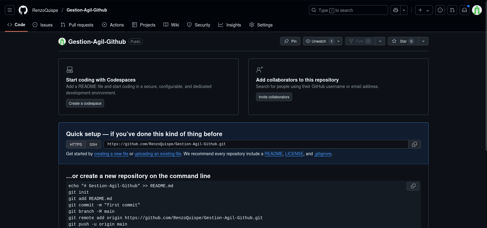
2. Una vez que estés en la página del repositorio, haz clic en la pestaña **Projects**.
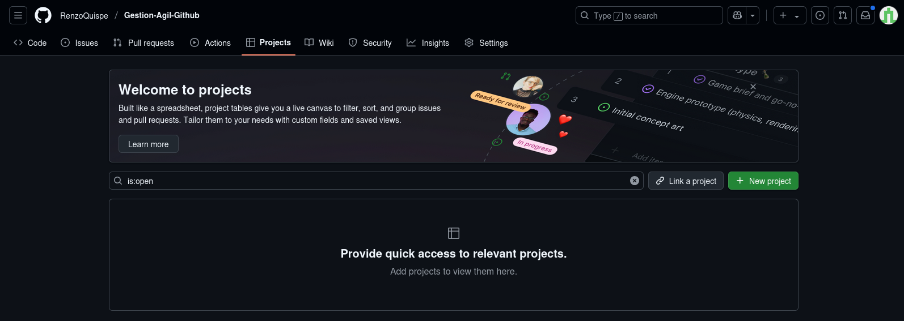
3. Al lado del botón **Link project**, haz clic en el menú desplegable y selecciona **New Project**.
4. Después de hacer clic en el botón **New Project**, aparecerá una ventana emergente para crear un proyecto. Selecciona **Kanban**.
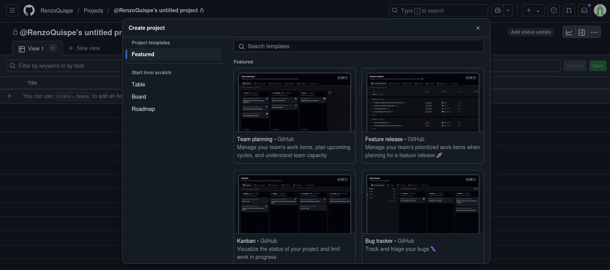
5. Nombra tu proyecto como **Devops-agile** y procede haciendo clic en el botón **Create project**.
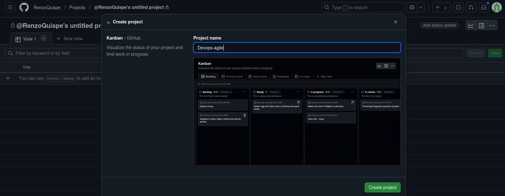
6. En el Kanban board del proyecto, tendrás columnas para representar diferentes etapas de tu flujo de trabajo, como **Backlog**, **Ready**, **In Progress**, **In review**, y **Done**. Puedes agregar columnas personalizadas según los requisitos de tu flujo de trabajo.  
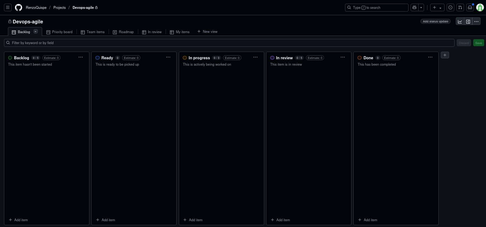
7. Para personalizar o modificar el nombre de una columna, haz clic en los tres puntos y luego selecciona **Edit details**.
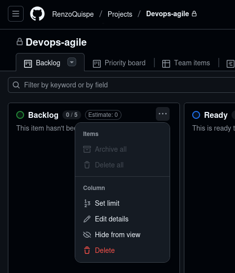
8. Cuando hagas clic en **Edit details**, aparecerá una ventana emergente, como se muestra en la captura de pantalla a continuación. Introduce el nombre de la columna requerido en el cuadro de texto resaltado. Puedes agregar una descripción apropiada o elegir eliminarla, luego haz clic en **Save** para confirmar los cambios.
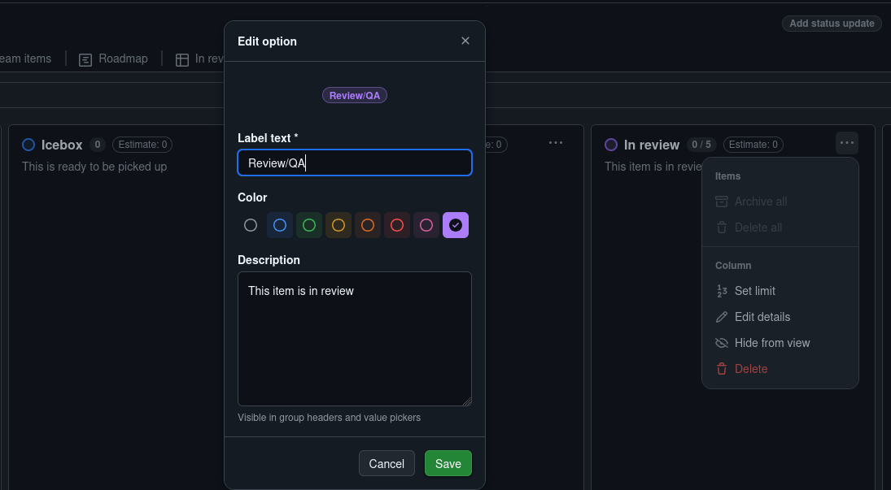
9. De manera similar, renombra las columnas restantes de la siguiente manera:
   - Renombra la columna **Ready** a **Icebox**.
   - Deja la columna **In Progress** tal como está.
   - Renombra la columna **In review** a **Review/QA**.
   - Deja la columna **Done** tal como está.
10. Después de realizar los cambios mencionados, presenta tu Kanban board.

11. Para agregar una nueva columna, navega al final de las columnas existentes y haz clic en el botón **+**. Luego, selecciona **New column** de las opciones. Introduce el nombre de la columna como **Product Backlog** en el campo de texto Label, y finalmente, haz clic en **Save** para aplicar los cambios.
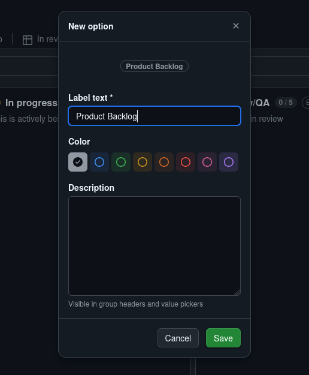
12. Para establecer la secuencia correcta en el Kanban board, arrastra la columna **Product Backlog** y colócala antes de la columna **In Progress**.

13. De manera similar, crea la columna **Sprint Backlogs**, y luego reorganízala para que se asemeje al Kanban board mostrado a continuación.[Ejemplo de tablero kanban](https://github.com/users/kapumota/projects/5)

#### Parte 2

En este ejercicio, crearás una issue template en GitHub que te ayudará a escribir historias de usuario bien formateadas en el Kanban board.

##### Crear una issue template en GitHub

En este ejercicio, crearás una issue template en GitHub. Esto solo necesita hacerse una vez para cada nuevo repositorio que crees.

1. En la página del repositorio que usaste en el ejercicio anterior, selecciona **Settings**.

2. Desplázate hacia abajo hasta la sección **Features** y selecciona **Set up templates**.
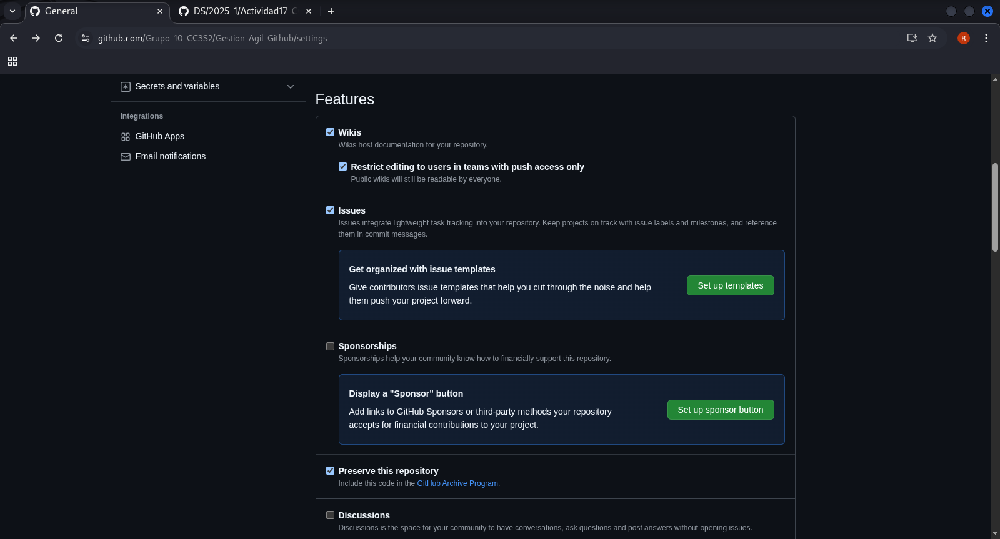
3. En la lista desplegable etiquetada **Add template**, selecciona **Custom template**.

4. Al lado de la entrada **Custom issue template**, presiona el botón **Preview and edit**.
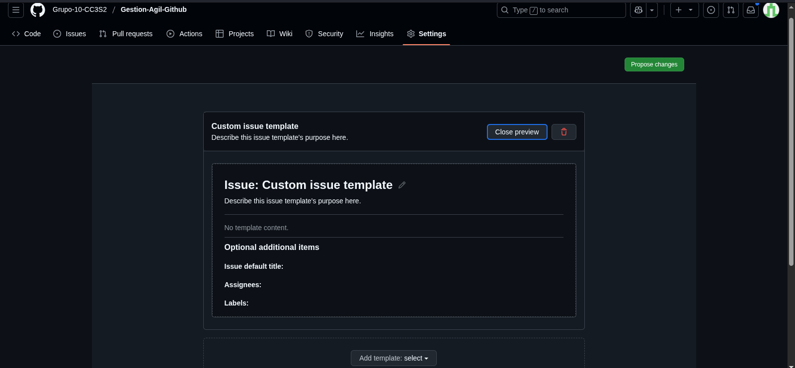
5. Selecciona el icono del lápiz para editar la template.
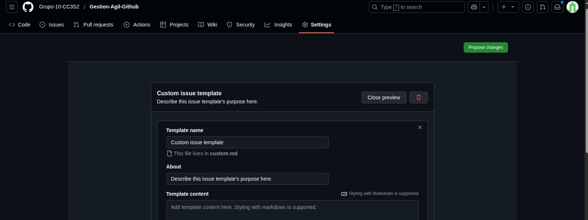
6. Copia el siguiente markdown para el contenido de la plantilla de historia:

[Ejemplo de plantilla de historia](https://github.com/users/kapumota/projects/5/views/1?pane=issue&itemId=96139438&issue=kapumota%7Cdevops-capstone-project%7C6)

7. Cambia el **Template name** a **User Story**, dale una descripción apropiada, y pega el contenido del markdown anterior en el **Template content**.
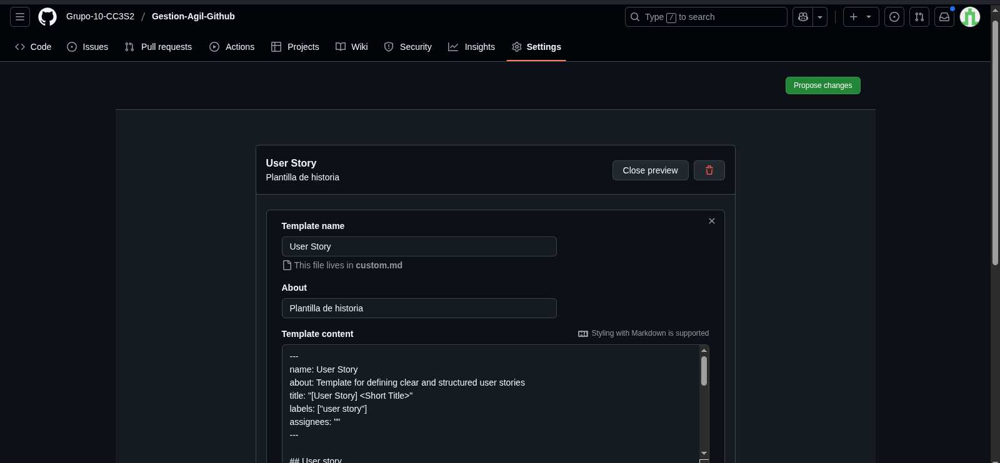
8. Desplázate hacia la parte superior de la página y presiona el botón **Propose changes**.
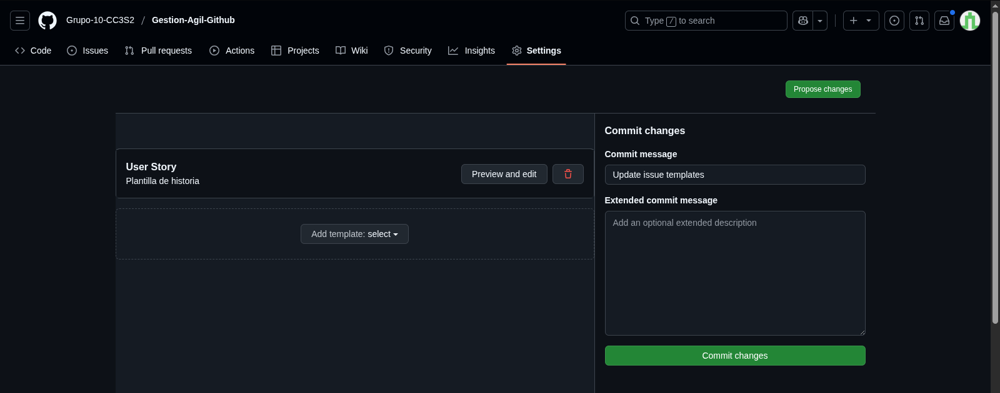
9. Presiona el botón **Commit changes** para confirmar el cambio en tu repositorio.
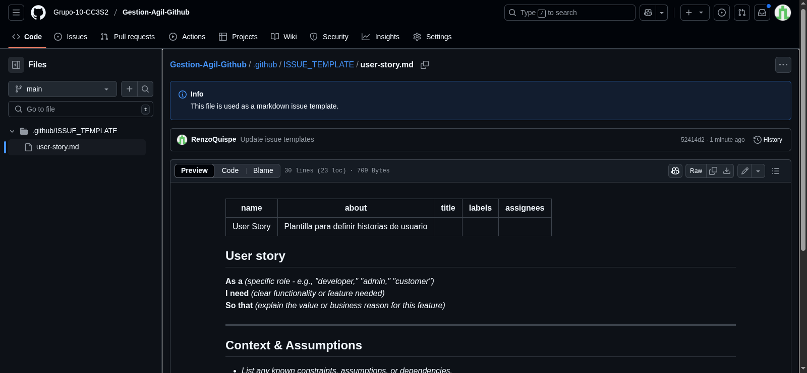
Ahora deberías tener una nueva carpeta en tu repositorio llamada `.github/ISSUE_TEMPLATES`, que contendrá tu nueva issue template de historia de usuario. [Revisa este ejemplo](https://github.com/kapumota/devops-capstone-project/tree/main/.github/ISSUE_TEMPLATE).

Ahora tienes una issue template que puedes usar para todos tus repositorios de GitHub en los que necesites escribir historias para usar en el Kanban board. Cuando creemos issues en los laboratorios futuros, esta template te guiará sobre qué información es necesaria para crear tu historia de usuario.

####  Parte 3

En este ejercicio crearás siete historias de usuario basadas en los requisitos dados. Las primeras cuatro se te proporcionarán. Solo tendrás que copiarlas y pegarlas para familiarizarte con la creación de historias de usuario en GitHub. Deberás crear las últimas tres historias de usuario por ti mismo. Luego priorizarás estas historias y las moverás a las columnas apropiadas en tu Kanban board.

#### Objetivos

Después de completar esta actividad podrás:

- Crear nuevas historias de usuario usando GitHub issues.
- Priorizar el product backlog.

##### 1: Crear nuevas historias de usuario usando GitHub issues

En este ejercicio, crearás las siguientes historias de usuario usando GitHub issues:

**Historias de la lección:**

1. **Título:** Need a service that has a counter  
   *Como un usuario, necesito un servicio que tenga un contador para que pueda hacer un seguimiento de cuántas veces se ha hecho algo.*  
   Puedes usar esta versión en inglés si deseas: *As a user, I need a service that has a counter so that I can keep track of how many times something has been done.*

2. **Título:** Must allow multiple counters  
   *Como un usuario, necesito tener múltiples contadores para que pueda hacer un seguimiento de varios conteos a la vez.*  
   Puedes usar esta versión en inglés si deseas: *As a user, I need to have multiple counters so that I can keep track of several counts at once.*

3. **Título:** Must persist counter across restarts  
   *Como proveedor de servicios, necesito que el servicio persista el último conteo conocido para que los usuarios no pierdan el seguimiento de sus conteos después de que el servicio se reinicie.*  
   Puedes usar esta versión en inglés si deseas: *As a service provider, I need the service to persist the last known count so that users don't lose track of their counts after the service is restarted.*

4. **Título:** Counters can be reset  
   *Como administrador del sistema, necesito la capacidad de reiniciar el contador para que pueda rehacer el conteo desde el principio.*  
   Puedes usar esta versión en inglés si deseas: *As a system administrator, I need the ability to reset the counter so that I can redo counting from the start.*

**Nuevos requisitos:**

- Deploy service to the cloud  
- Need the ability to remove a counter  
- Need the ability to update a counter to a new value  

**Requisito previo:**
Asegúrate de haber creado la Issue template. Si la template aún no se ha creado, completa el ejercicio anterior.

1. Ve a la pestaña **Issues** del repositorio del curso o donde estés trabajando la actividad.

2. Haz clic en el botón **New issue**.

3. Verás tu template listada aquí. Haz clic en el botón **Get Started**.

4. Introduce el título para la primera historia como **Need a service that has a counter** y actualiza la sección de historia de usuario (es decir, As a, I need, So that) por ahora. Una vez hecho, haz clic en el botón **Submit new issue**.
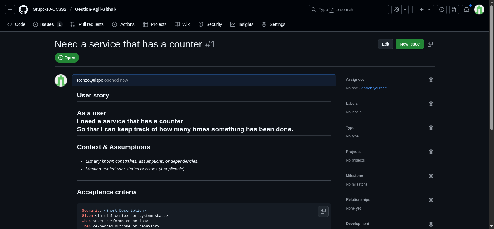
Tu primera historia de usuario ahora está creada 

5. Agregar la historia de usuario creada al Kanban board, haz clic en el botón de configuración al lado de la opción **Projects**, y luego elige el proyecto **Devops-agile** del menú desplegable que creaste en el ejercicio anterior.
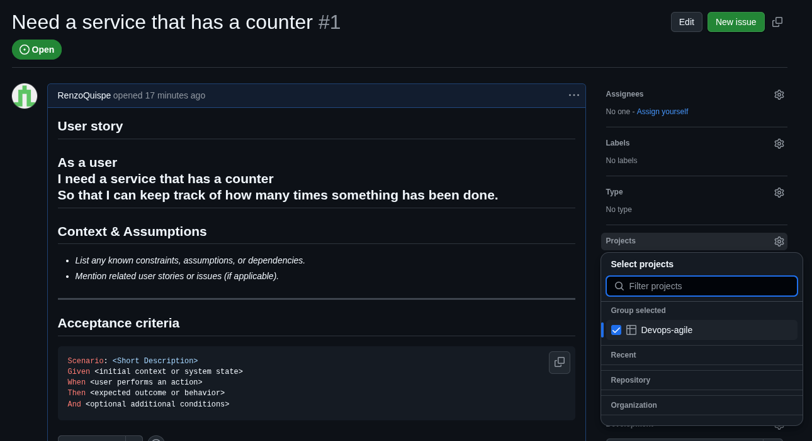
6. A continuación, selecciona el menú desplegable **Status** y elige **New Issues**. Esta acción moverá la historia de usuario creada a la columna 'New Issues' en el Kanban board.
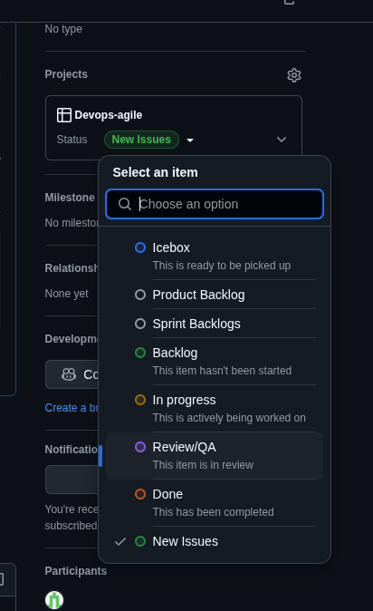
7. Para ver la historia de usuario recién creada en el Kanban board, navega a la pestaña **Projects** y selecciona el proyecto titulado **Devops-agile**.
8. Notarás que la historia de usuario recién creada ahora está listada bajo la columna **New Issues**.
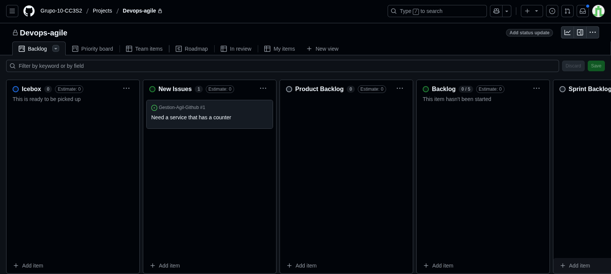
9. Dado que debemos crear un total de siete historias de usuario, ajustemos el límite predeterminado a 7. Para lograr esto, haz clic en los tres puntos de la columna **New Issues**, luego selecciona la opción **Set limit**.
10. Introduce el límite como 7 en el campo de texto **Column limit** y haz clic en **Save**. Ten en cuenta que, similar a esto, puedes optar por modificar los límites de otras columnas o mantener los límites predeterminados.
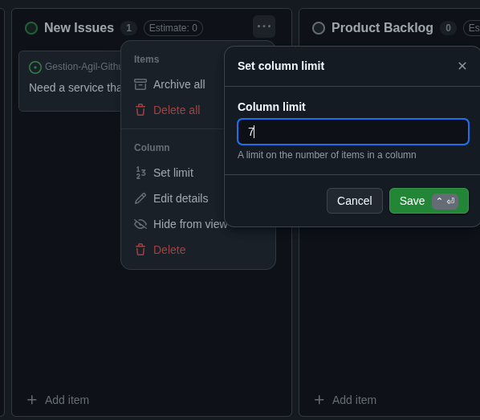
11. Para regresar a la pestaña **Issues** para crear nuevas historias de usuario, simplemente haz clic en el botón de retroceso del navegador.
12. Continúa agregando historias hasta que las siete estén creadas y completa tu Kanban. Las primeras cuatro historias se proporcionan en la lección Deberás crear tu propio rol, función y beneficio para las últimas tres historias.
- Se agrego las primeras cuatro historias proporcionadas

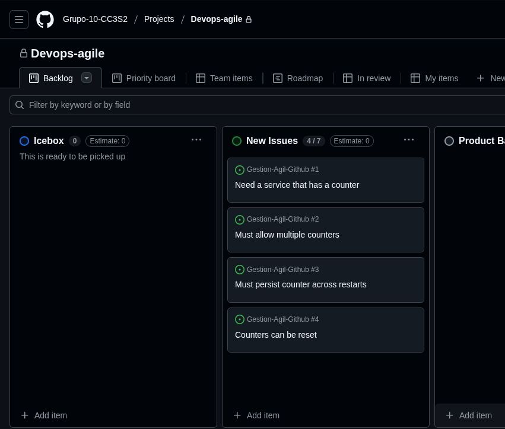
- Se creo otras 3 historias para completar 7 historias en total.
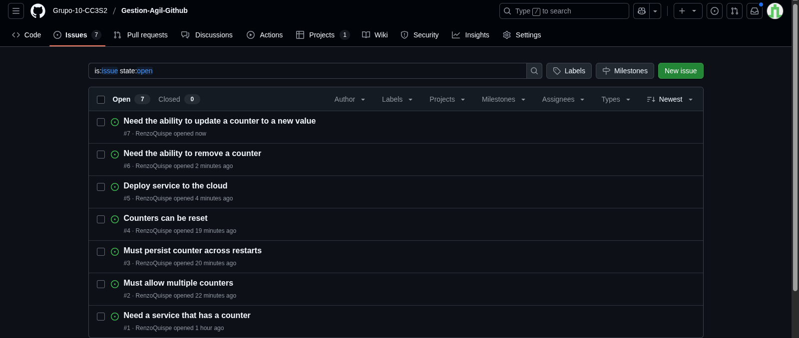

##### Ejercicio: Priorizar el product backlog

En este ejercicio, moverás issues entre columnas para recrear el Kanban board del video de la lección **Building the Product Backlog**. Esto simulará un punto de partida inicial para nuestro próximo laboratorio sobre la refinación del backlog. Ten en cuenta que puedes mover los issues entre columnas simplemente arrastrándolos y soltándolos de una columna a otra.

1. Mueve la historia **Need a service that has a counter** al inicio de la columna **Product Backlog**.

2. Mueve la historia **Must allow multiple counters** a la columna **Icebox**.

3. Mueve la historia **Must persist counter across restarts** al final de la columna **Product Backlog**.

4. Mueve la historia **Counters can be reset** al final de la columna **Product Backlog**.

5. Deja las historias restantes en la columna **New Issues** por ahora. Las moveremos en un laboratorio posterior.

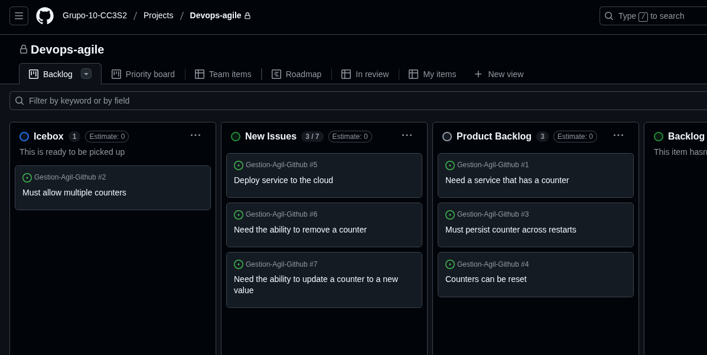

#### Parte 4

En este ejercicio, seguirás los pasos para llevar a cabo una reunión de refinamiento del backlog. Serás el product owner preparando el product backlog para tu próxima reunión de planificación del sprint. Esto implica preparar las historias que creamos en el último ejercicio para hacerlas listas para el sprint.

##### Objetivos

Después de completar este ejercicio, podrás:

- Triage de nuevos issues  
- Hacer que las historias estén listas para el sprint  
- Crear nuevas labels  
- Añadir labels a las historias  

##### Estado inicial

**New Issues:**
- Deploy service to the cloud
- Need the ability to remove a counter
- Need ability to update a counter to a new value

**Icebox:**
- Must allow multiple counters

**Product Backlog:**
- Need a service that has a counter
- Must persist counter across restarts
- Counters can be reset

##### 1: Triage de nuevos issues

En este ejercicio, tomarás todas las historias en la columna **New Issues** y las moverás a una columna apropiada o las rechazarás.

1. Ve a [github.com](http://github.com/) e inicia sesión con tu cuenta de GitHub y abre tu Kanban board.

2. El primer nuevo issue es **Deploy service to the cloud**. Queremos hacer eso después de agregar persistencia, así que muévelo a la columna **Product Backlog** bajo **Must persist counter across restarts**.

3. El siguiente nuevo issue es **Need the ability to remove a counter**. Solo tenemos un contador y no quisiéramos eliminarlo, así que muévelo al **Icebox** después de **Must allow multiple counters**.

4. El último nuevo issue es **Need ability to update a counter to a new value**. Podríamos querer hacerlo como una mejora después de poder reiniciar el contador, así que muévelo al **Product Backlog** después de **Counters can be reset**.

Ahora has completado el triage de nuevos issues y puedes comenzar a hacer que las historias en la columna **Product Backlog** estén listas para el sprint.

##### 2: Hacer que las historias estén listas para el sprint

En esta parte, agregarás más detalles a las historias en el **Product Backlog** que creas que podrían entrar en el próximo sprint. Se te proporcionarán los detalles para dos de las historias. Debes proporcionar los detalles para las otras tres.

1. Selecciona la primera historia en la parte superior de la columna **Product Backlog** para abrirla. Haz clic en los tres puntos y luego selecciona el botón **Edit** para editar el issue.

2. Edita los **Details** y **Assumptions** para que los desarrolladores sepan lo que sabemos, y edita los **Acceptance Criteria** para asegurar que todos entiendan cuál es la definición de "hecho(done)". 

3. Cuando termines de editar, presiona el botón **Save** para guardar las ediciones.

4. Cierra la ventana presionando el icono de X.

5. Edita la historia **Must persist counter across restarts** de la misma manera.

6. Edita las siguientes historias con tus propios detalles, suposiciones y criterios de aceptación:
   - Deploy service to the cloud
   - Counters can be reset
   - Need ability to update a counter to a new value

Al completar este ejercicio, tu Kanban board debería tener suficientes detalles en todas las historias del **Product Backlog** para hacerlas listas para el sprint.

##### 3: Crear nuevas labels en GitHub

En este ejercicio, crearás una nueva label en GitHub llamada **technical debt** para marcar aquellas historias que no aportan valor visible al cliente pero deben completarse para continuar con el desarrollo.

1. Desde la página de tu repositorio, selecciona la pestaña **Issues**.

2. Desde la página de issues, selecciona el botón **Labels**.

3. Desde la página de labels, selecciona el botón **New label**.

4. En la sección de nueva label:  
   (1) establece el nombre de la label como **technical debt**  
   (2) establece el Color como amarillo (#FBCA04)  
   (3) presiona el botón **Create label**.

Ahora deberías ver una label amarilla **technical debt** que podemos usar para anotar nuestras historias.

##### 4: Añadir labels a las historias

En este ejercicio, añadirás labels a las historias en el **Product Backlog** para hacerlas aún más listas para el sprint. También usarás nuestra nueva label llamada **technical debt** para marcar aquellas historias que no aportan valor visible al cliente pero deben completarse para continuar con el desarrollo.

1. Selecciona la primera historia en la parte superior de la columna **Product Backlog** para abrirla. Luego, presiona el icono de engranaje al lado de **Labels** para asignar una label.

2. Nuestra primera historia es una mejora a nuestro producto. Desde el menú de labels, selecciona **enhancement** para reflejar eso.

3. Haz clic en cualquier parte fuera del menú de labels para cerrarlo. Ahora deberías ver que la label **enhancement** ha sido asignada a esta historia.

4. Selecciona cada una de las siguientes historias en la columna **Product Backlog** y asígnales las labels correspondientes:

   - **Story Title:** Must persist counter across restarts  
     **Label:** enhancement  

   - **Story Title:** Deploy service to the cloud  
     **Label:** technical debt  

   - **Story Title:** Counters can be reset  
     **Label:** enhancement  

   - **Story Title:** Need ability to update a counter to new value  
     **Label:** enhancement  

**Nota**: Si has añadido las labels pero no las ves en el Kanban board, sigue estos pasos:

1. Abre el menú desplegable al lado de **Backlog** (resaltado como 1 en la captura de pantalla a continuación).
2. Haz clic en la flecha al lado de la opción **Fields** (resaltado como 2).
3. Arrastra y suelta **Labels** de la lista de campos ocultos a la lista de campos visibles (resaltado como 3).
4. Haz clic en el botón **Save** (resaltado como 4) para guardar los cambios.

Al final de este ejercicio, tu Kanban board debería verse así: [Ejemplo de tablero de Kanban ](https://github.com/users/kapumota/projects/5/views/1)

### Ejercicios

##### Ejercicio 1: Crear un Epic y vincular historias de usuario

**Objetivo:** Aprender a organizar historias de usuario más grandes en Epics y vincular múltiples historias de usuario a un Epic.

**Instrucciones:**

1. Crea un nuevo Epic en tu Kanban board llamado "Gestión de Contadores".
2. Vincula las historias de usuario existentes, como "Need a service that has a counter", "Must allow multiple counters", y "Counters can be reset" a este Epic.
3. Añade una nueva historia de usuario bajo este Epic que abarque una funcionalidad adicional (por ejemplo, "Generar reportes de uso de contadores").

**Resultado esperado:** El Epic "Gestión de Contadores" debe contener las historias de usuario relacionadas, proporcionando una visión global de esta funcionalidad.

##### Ejercicio 2: Uso avanzado de etiquetas (labels) para priorización y estado

**Objetivo:** Aprender a usar etiquetas de manera más detallada para indicar la prioridad y el estado de las historias.

**Instrucciones:**

1. Crea nuevas etiquetas como **high priority**, **medium priority**, y **low priority**.
2. Asigna una de estas etiquetas a cada historia de usuario en el Product Backlog para indicar su prioridad.
3. Crea etiquetas adicionales como **in review**, **blocked**, y **ready for testing**.
4. Usa estas etiquetas para actualizar el estado de las historias según su progreso en el Kanban board.

**Resultado esperado:** Las historias de usuario tendrán etiquetas que indiquen tanto su prioridad como su estado actual, facilitando la gestión del flujo de trabajo.

##### Ejercicio 3: Automatización de Kanban board con GitHub Actions

**Objetivo:** Aprender a automatizar tareas en el Kanban board usando GitHub Actions.

**Instrucciones:**

1. Configura un flujo de trabajo de GitHub Actions que automáticamente mueva las historias de usuario entre columnas del Kanban board basado en eventos. Por ejemplo, mover automáticamente una historia a "In Progress" cuando se asocia un pull request.
2. Crea un archivo de configuración de GitHub Actions en la carpeta `.github/workflows` que defina estas reglas de automatización.

**Resultado esperado:** Las historias de usuario se mueven automáticamente en el Kanban board según las reglas definidas, como cambiar de columna al asociar un pull request o al cerrar un issue.

##### Ejercicio 4: Seguimiento de tiempo y esfuerzo usando GitHub Projects

**Objetivo:** Aprender a usar el seguimiento de tiempo y esfuerzo para las historias de usuario en GitHub Projects.

**Instrucciones:**

1. Añade un campo personalizado en tu Kanban board para registrar el esfuerzo estimado de cada historia de usuario (en horas).
2. Establece una estimación de esfuerzo para cada historia en el Product Backlog.
3. Durante el sprint, actualiza el campo para reflejar el tiempo real invertido en cada historia.

**Resultado esperado:** Cada historia de usuario tendrá una estimación de tiempo y un registro del tiempo real invertido, permitiendo un análisis del esfuerzo requerido.

##### Ejercicio 5: Refinamiento de backlog basado en comentarios de los stakeholders

**Objetivo:** Aprender a refinar las historias de usuario del Product Backlog basado en comentarios de los stakeholders.

**Instrucciones:**

1. Imagina que has recibido comentarios de stakeholders indicando que necesitan una funcionalidad adicional, como "Exportar datos del contador a CSV".
2. Crea una nueva historia de usuario basada en estos comentarios.
3. Realiza una sesión de refinamiento del backlog y prioriza esta nueva historia en el Product Backlog.
4. Añade los detalles necesarios para que esta historia esté lista para el sprint, incluyendo criterios de aceptación.

**Resultado esperado:** La nueva historia de usuario basada en los comentarios de los stakeholders está correctamente integrada y priorizada en el Product Backlog.

##### Ejercicio 6: Análisis del flujo de trabajo usando el Kanban board

**Objetivo:** Analizar el flujo de trabajo usando las métricas proporcionadas por el Kanban board.

**Instrucciones:**

1. Activa las métricas en GitHub Projects para tu Kanban board.
2. Observa y analiza las métricas generadas, como el tiempo promedio en cada columna y el número de historias completadas.
3. Identifica cuellos de botella en tu flujo de trabajo e identifica posibles mejoras.

**Resultado esperado:** Obtención de un análisis detallado del flujo de trabajo y una lista de posibles acciones para mejorar la eficiencia del equipo, de acuerdo a lo que se presenta en github.

