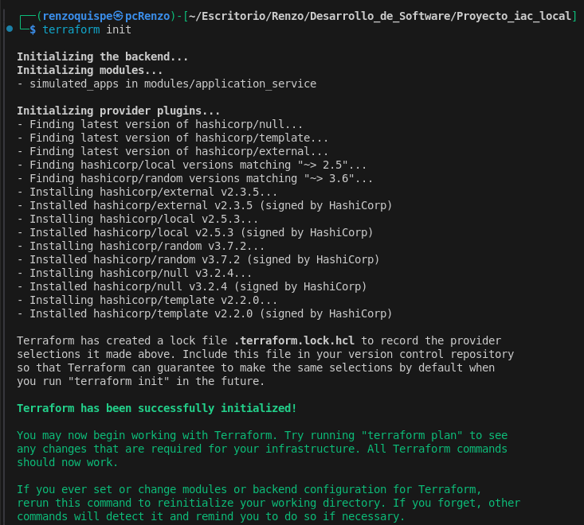
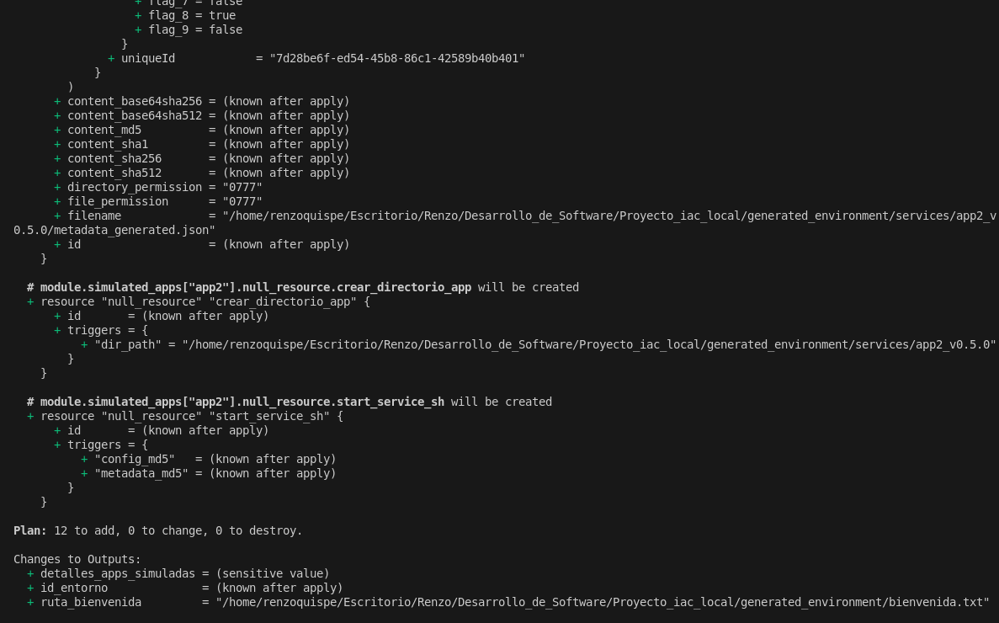
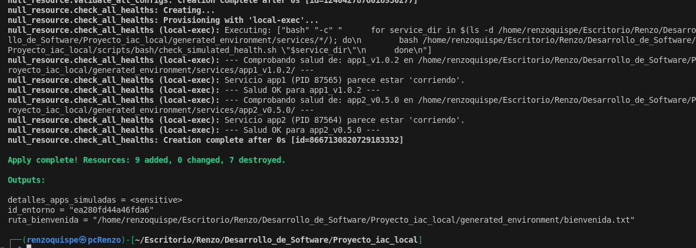

### Orquestador local de entornos de desarrollo simulados

Esta carpeta contiene un **orquestador local** que, mediante Terraform, crea, configura y valida entornos de desarrollo simulados con múltiples servicios.

### Comandos Terraform

Los siguientes comandos se ejecutan desde la raíz del proyecto (revisa [Terraform CLI Overview](https://developer.hashicorp.com/terraform/cli/commands)):

1. **Inicializar Terraform**

   ```bash
   terraform init
   ```

   * Descarga los providers (`local`, `random`).

   

2. **Planificar cambios**

   ```bash
   terraform plan -var-file="terraform.tfvars" (tambien puedes usar terraform plan)
   ```

   * Muestra qué recursos se crearán, actualizarán o destruirán.
   * Puede filtrarse por variables específicas:

     ```bash
     terraform plan -var="nombre_entorno=dev_local" -var-file="terraform.tfvars"
     ```

   

3. **Aplicar cambios**

   ```bash
   terraform apply -var-file="terraform.tfvars" -auto-approve (tambien puedes usar terraform apply)
   ```

   

   * Ejecuta la orquestación completa:

     1. Setup de entorno base
     2. Creación de servicios (`app1`, `app2`, `database_connector`, ...)
     3. Validación de configuraciones
     4. Health checks de servicios

4. **Ver outputs**

   ```bash
   terraform output id_entorno
   terraform output ruta_bienvenida
   terraform output detalles_apps_simuladas
   ```

   * Muestra valores útiles generados (IDs, rutas, metadata).

5. **Destruir recursos**

   ```bash
   terraform destroy -var-file="terraform.tfvars" -auto-approve
   ```

   * Limpia todo el entorno creado.

6. **Operaciones avanzadas**

   * Destruir un módulo específico:

     ```bash
     terraform destroy -target=module.simulated_apps["app2"] -auto-approve
     ```

   * Volver a aplicar solo un módulo:

     ```bash
     terraform apply -target=module.environment_setup -auto-approve
     ```
#### Principios aplicados

* **Reproducibilidad**: el mismo plan/aplicar produce siempre el mismo estado.
* **Idempotencia**: aplicar múltiples veces sin cambios inesperados.
* **Composabilidad**: cada módulo es independiente y reutilizable.
* **Evolutividad**: añadir o modificar servicios cambiando solo variables o `locals`.

