## **Actividad 4:** Introducción a Git - conceptos básicos y operaciones esenciales

### Objetivo de aprendizaje

Familiarizarse con los conceptos básicos de Git y realizar operaciones esenciales, como la configuración inicial, creación de repositorios, preparación y confirmación de cambios, visualización de historial, y gestión de ramas.

### Preguntas

- ¿Cómo te ha ayudado Git a mantener un historial claro y organizado de tus cambios?
Con los comando que tiene es posible visualizar el historial de forma clara "git log --graph --oneline --all" y "git log --oneline" y con "git rebase" podemos organizar los multiples commit que hacemos, ya que combinamos varios commits en uno solo y tenemos el historial mas limpio.
- ¿Qué beneficios ves en el uso de ramas para desarrollar nuevas características o corregir errores?  
Orden en el desarrollo colaborativo, de tal manera que cada uno trabaja en su implementacion, para despues juntar dichas implementaciones. Tambien sirve como un desarrollo de prueba, si en dicha rama desarrollamos correctamente, incluimos los cambios a la rama master.
- Realiza una revisión final del historial de commits para asegurarte de que todos los cambios se han registrado correctamente.  
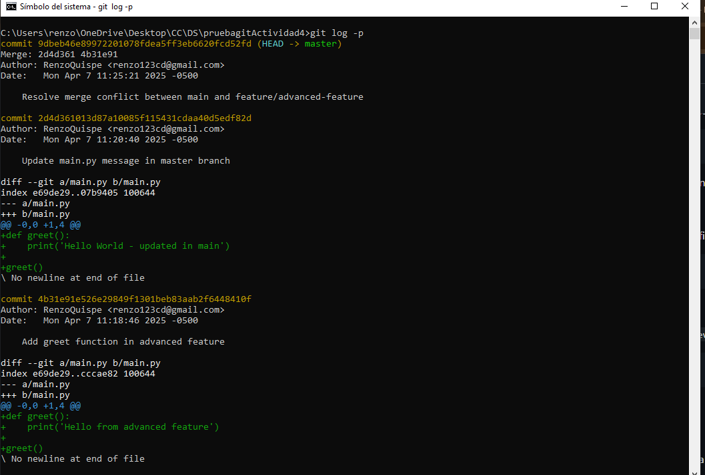
- Revisa el uso de ramas y merges para ver cómo Git maneja múltiples líneas de desarrollo.
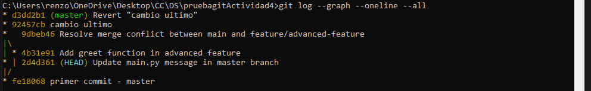 
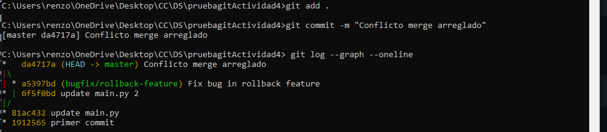

### Ejercicio 1: Manejo avanzado de ramas y resolución de conflictos
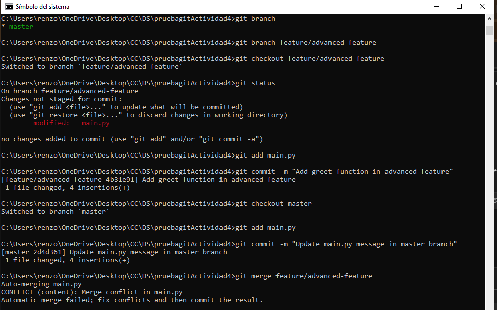
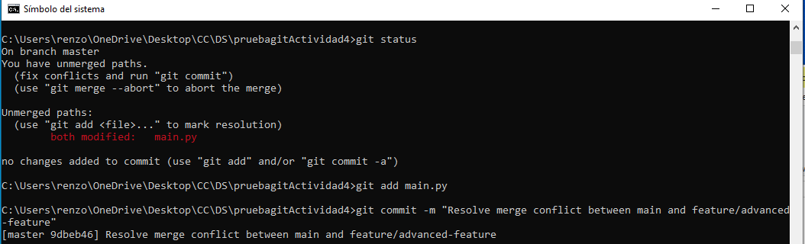
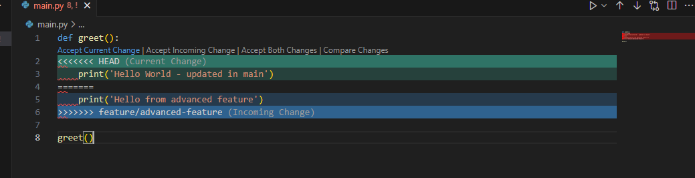
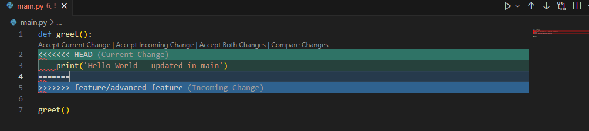
### Ejercicio 2: Exploración y manipulación del historial de commits

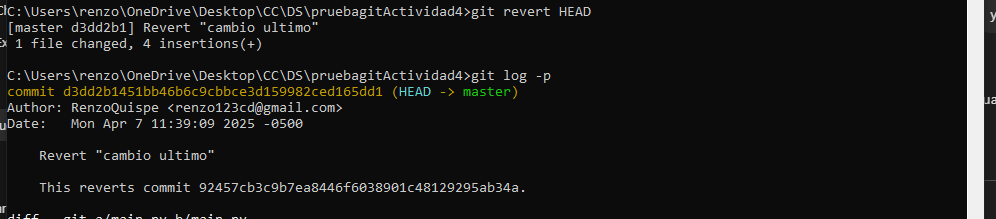
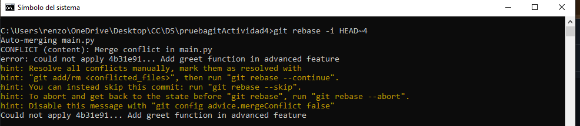
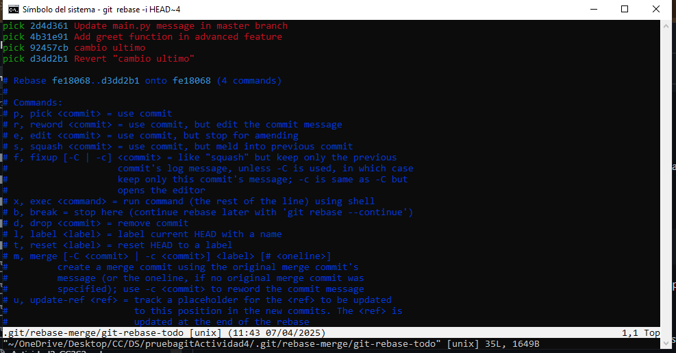

### Ejercicio 3: Creación y gestión de ramas desde commits específicos
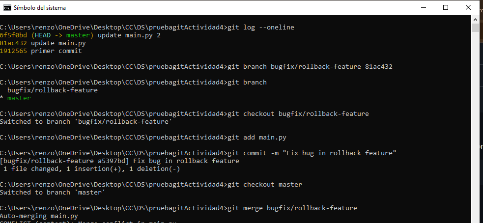

### Ejercicio 4: Manipulación y restauración de commits con git reset y git restore
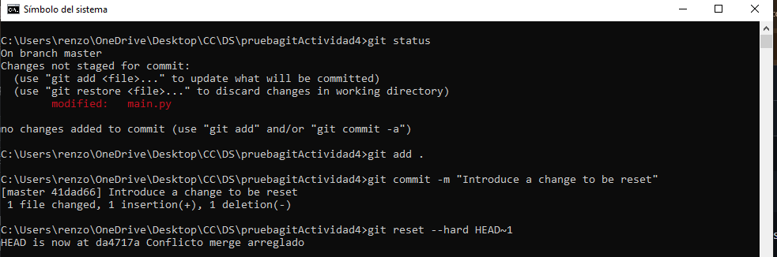
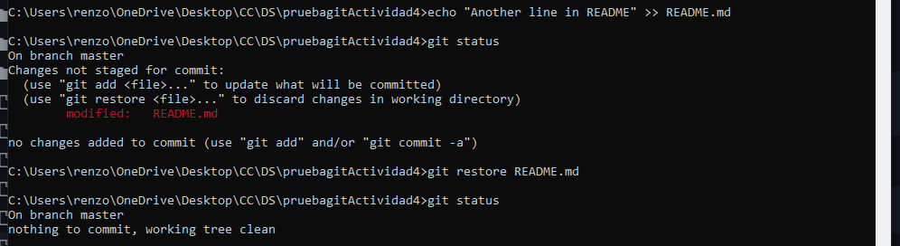
### Ejercicio 5: Trabajo colaborativo y manejo de Pull Requests
 - Crear un nuevo repositorio remoto:
  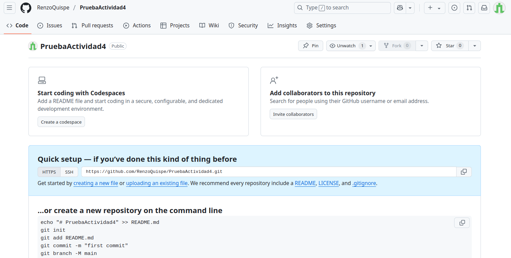
  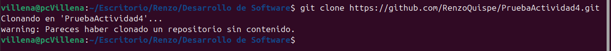
 - Crear una nueva rama para desarrollo de una característica:
  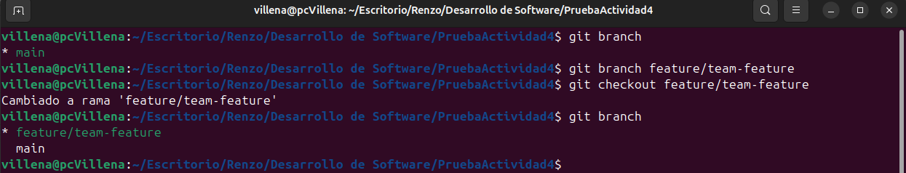
 - Realizar cambios y enviar la rama al repositorio remoto:
  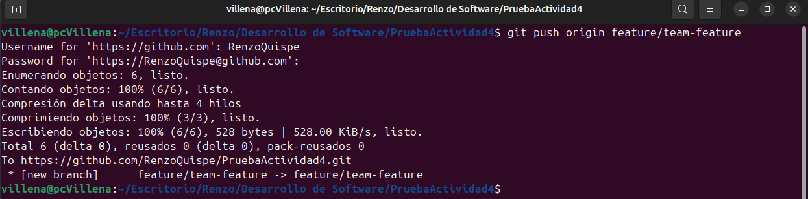
 - Abrir un Pull Request:
  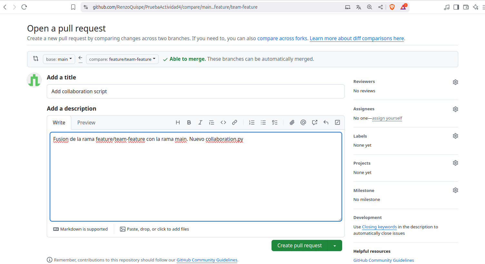
 - Revisar y fusionar el Pull Request:
  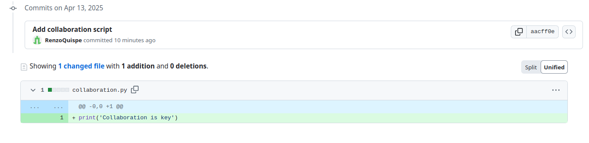
  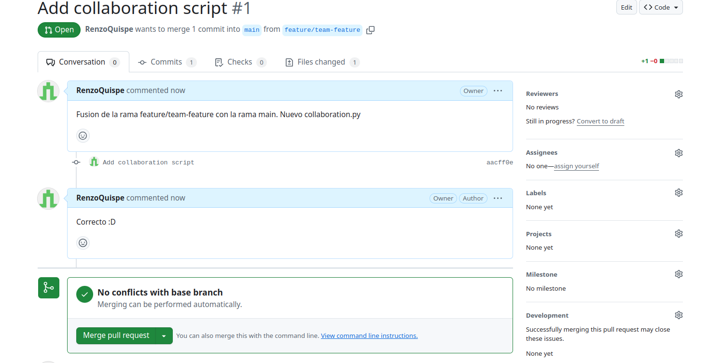
 - Eliminar la rama remota y local:
  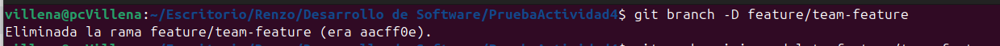
### Ejercicio 6: Cherry-Picking y Git Stash
 - Hacer cambios en main.py y confirmarlos:
  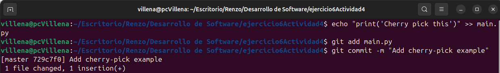
 - Crear una nueva rama y aplicar el commit específico:
  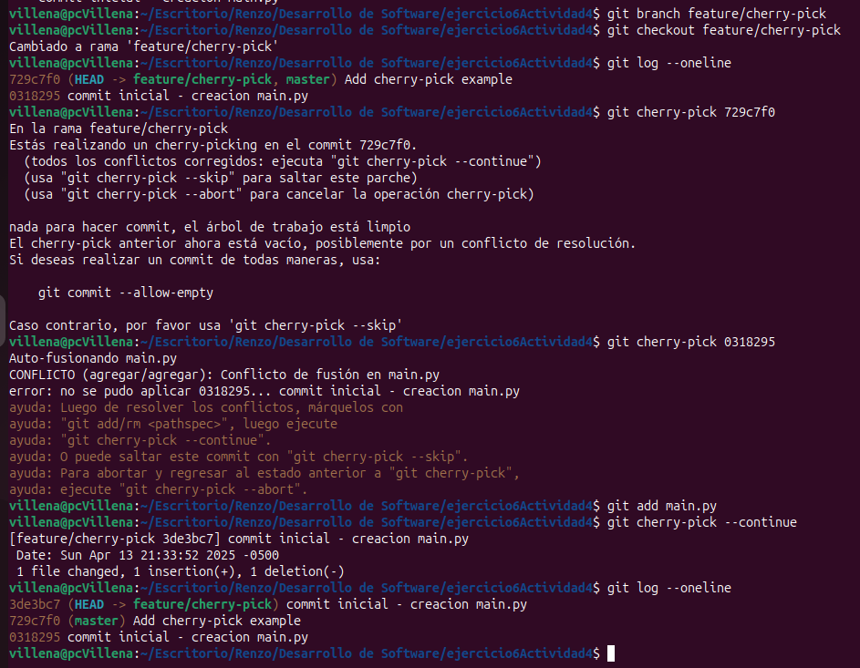
 - Guardar temporalmente cambios no confirmados
  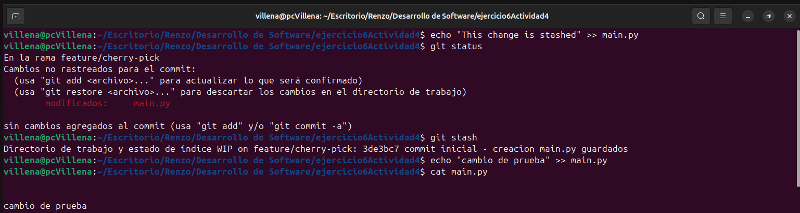
 - Aplicar los cambios guardados:
  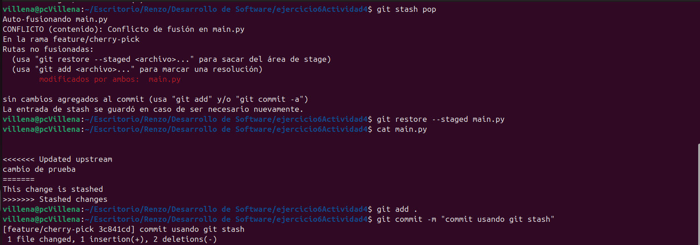
 - Revisar el historial y confirmar la correcta aplicación de los cambios:
  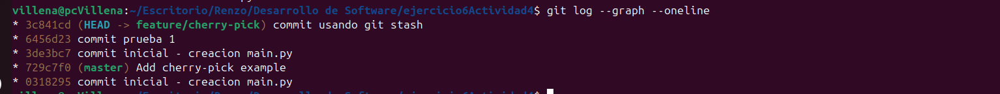
Presentación PPT:
[Ver ppt de la exposicion](DS_Actividad4.pdf)