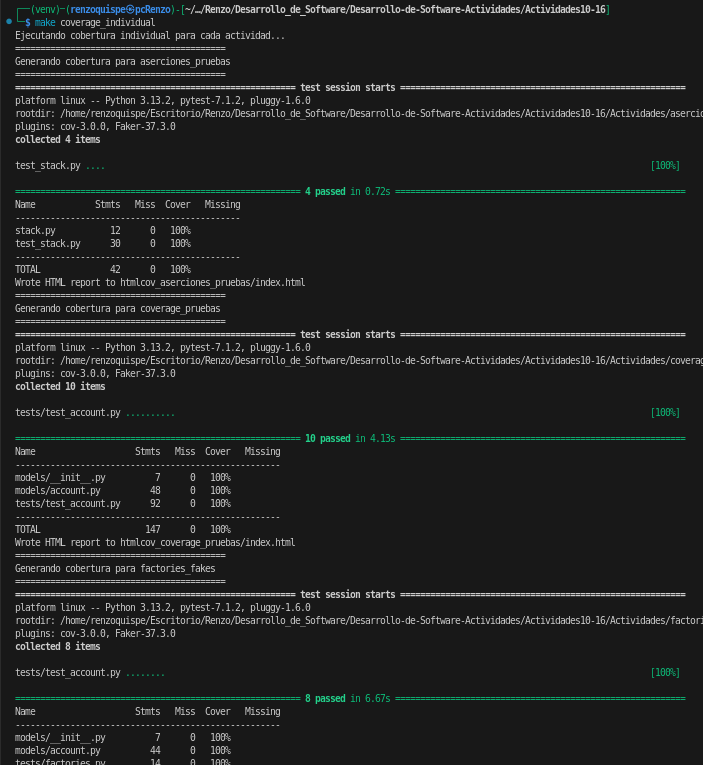
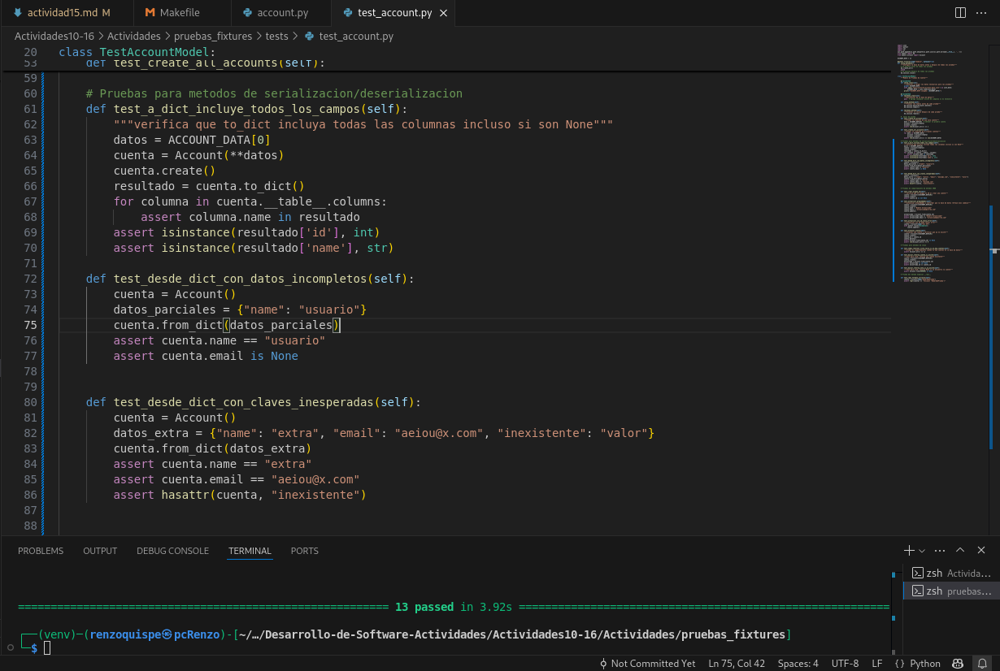
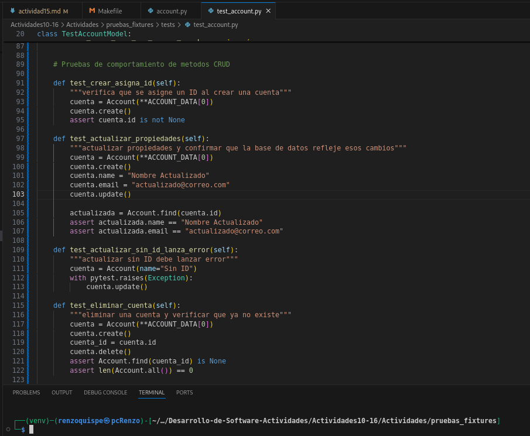
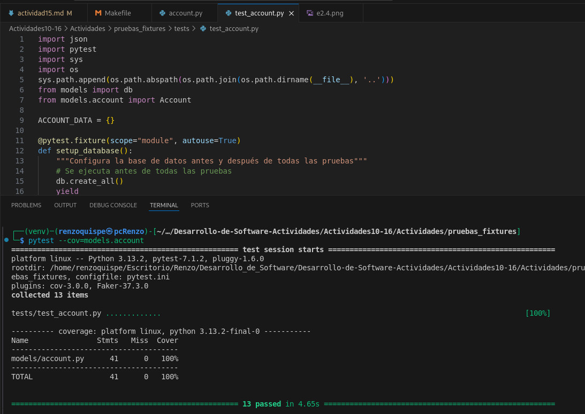
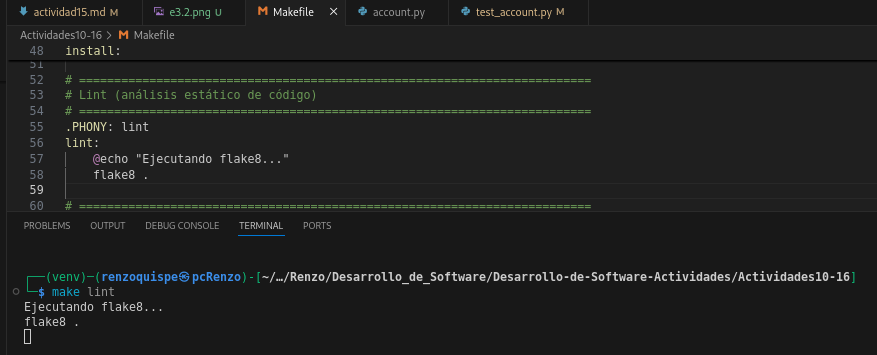
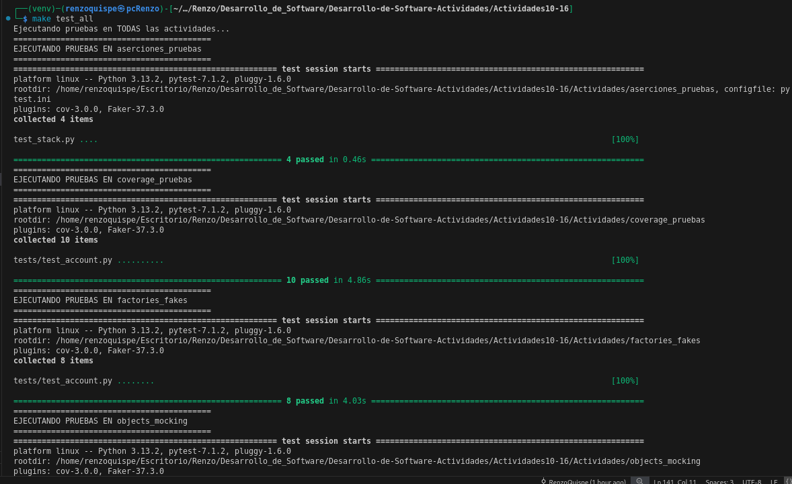
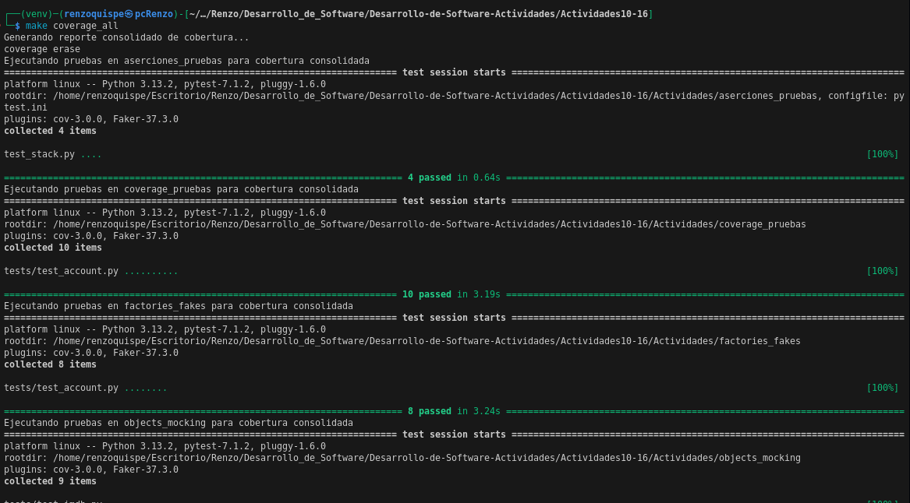

### Actividad: Cobertura de pruebas


#### 1. Introducción a la cobertura de código

La **cobertura de código** es una métrica que nos indica qué porcentaje del código fuente se ejecuta durante la ejecución de los tests. Esto nos ayuda a identificar áreas no testeadas y a mejorar la calidad de nuestras pruebas. Entre los tipos de cobertura más comunes se encuentran:

- **Cobertura de sentencias (statements):** Verifica que cada línea o instrucción del código se haya ejecutado.
- **Cobertura de ramas (branches):** Asegura que todas las decisiones (condiciones if/else) han sido evaluadas en todas sus posibilidades (verdadero y falso).
- **Cobertura de funciones/métodos:** Comprueba que cada función o método ha sido invocado al menos una vez.
- **Cobertura de condiciones:** Analiza que todas las subexpresiones booleanas dentro de una condición se evalúan en ambos resultados (true/false).

Cada tipo de cobertura nos da una perspectiva diferente sobre la calidad y exhaustividad de nuestros tests.

#### 2. Importancia del Makefile en el proceso de testing

El **Makefile** es una herramienta de automatización que permite definir y agrupar comandos en tareas fácilmente ejecutables. En el ejemplo que has mostrado se puede apreciar cómo se utiliza para:

- **Estandarizar comandos:** Permite definir comandos como `make test` o `make coverage_individual` para ejecutar pruebas y generar reportes de cobertura de forma uniforme.
- **Automatizar procesos repetitivos:** Al centralizar la ejecución de tests y la generación de reportes, se evita tener que recordar la sintaxis exacta de cada comando, lo que facilita el flujo de trabajo.
- **Facilitar la integración continua (CI):** En entornos de desarrollo colaborativo, un Makefile bien estructurado asegura que todos los desarrolladores ejecuten los mismos comandos, lo que mejora la coherencia en la calidad del código.
- **Flexibilidad:** La variable `ACTIVITY` en el Makefile permite especificar sobre qué actividad (o módulo) se quiere ejecutar los tests, lo que resulta especialmente útil en proyectos con múltiples componentes.

En el ejemplo, el target `coverage_individual` recorre cada actividad (como `aserciones_pruebas`, `coverage_pruebas`, etc.) y, para cada una, ejecuta los tests, genera el reporte de cobertura y crea un directorio HTML con el reporte. Esto muestra cómo se puede automatizar y segmentar el proceso de análisis de cobertura en proyectos grandes.

#### 3. Propuesta de actividad práctica

##### Objetivos:
- Comprender los distintos tipos de cobertura de código.
- Aprender a generar reportes de cobertura utilizando **coverage.py**.
- Entender la importancia de los Makefiles para automatizar procesos en el ciclo de desarrollo.

##### Instrucciones:

1. **Preparación del entorno:**
   - Clona el repositorio que contenga el Makefile y la estructura de actividades.
   - Ejecuta `make install` para instalar las dependencias necesarias (según el target `install`).

2. **Ejecución de tests y generación de cobertura:**
   - Ejecuta `make test` para correr los tests de la actividad por defecto o de la actividad que especifiques usando `ACTIVITY=nombre_actividad`.
   - Ejecuta `make coverage_individual` para generar, de manera individual, los reportes de cobertura de cada actividad. Verifica en los directorios generados (`htmlcov_aserciones_pruebas`, `htmlcov_coverage_pruebas`, etc.) la visualización de los reportes HTML.

3. **Análisis del reporte de cobertura:**
   - Abre uno de los reportes HTML en tu navegador.
   - Identifica las áreas del código que tienen menos cobertura. Observa las métricas de cobertura de sentencias, ramas y funciones.
   - Reflexiona sobre qué partes del código podrían necesitar más tests (por ejemplo, ramas condicionales no ejecutadas).

4. **Mejorando la cobertura:**
   - Selecciona un módulo con cobertura parcial (por ejemplo, donde faltan tests para algunas ramas).
   - Escribe nuevos tests que cubran esos casos no evaluados.
   - Vuelve a ejecutar `make test` y `make coverage_individual` para confirmar que la cobertura ha mejorado.

5. **Discusión y conclusión:**
   - Documenta en un breve informe los distintos tipos de cobertura que identificaste y cómo cada uno aporta al aseguramiento de la calidad del código.
   - Explica la utilidad del Makefile en tu flujo de trabajo y cómo automatiza procesos que, de otro modo, serían manuales y propensos a errores.

#### Ejercicios

#### Ejercicio 1: Análisis y evaluación de la cobertura actual

**Objetivo:**  
Conocer el estado actual de la cobertura y detectar áreas del código que podrían necesitar pruebas adicionales.

**Pasos:**

1. **Ejecutar el makefile de cobertura individual:**  
   Utiliza el comando:  
   ```bash
   make coverage_individual
   ```  
   Esto generará reportes HTML por cada actividad (en este caso, la actividad relacionada con el modelo `Account`).
   
2. **Abrir los reportes HTML:**  
   Revisa, por ejemplo, el reporte en `htmlcov_pruebas` abriéndolo en tu navegador.  
   - Analiza qué funciones o líneas tienen menor cobertura.
   - Presta atención a los métodos con condicionales (como el método `update`) y verifica que se hayan probado tanto los casos en los que se asigna un ID como los que no lo tienen.
   
3. **Documentar las observaciones:**  
   Registra en un breve informe qué partes del código no están totalmente cubiertas y plantea posibles razones o casos de prueba faltantes.
   - En la Actividad 12 (pruebas_fixtures) el modulo models/account.py tiene solo 68% de cobertura.
     Hay 13 lineas sin cobertura
     Lineas de codigo sin cobertura: 26, 30, 34-35, 45-48, 52-54, 74-75
   

#### Ejercicio 2: Ampliar las pruebas para mejorar la cobertura

**Objetivo:**  
Aumentar la cobertura de pruebas escribiendo tests que exploren casos adicionales y validen el comportamiento de cada método del modelo `Account`.

**Propuestas:**

1. **Pruebas para métodos de serialización/deserialización:**
   - **`to_dict`:**  
     - Verificar que se incluyan todas las columnas, incluso si algunos valores son `None`.  
     - Asegurarse de que los tipos de datos sean los esperados.
     
   - **`from_dict`:**  
     - Probar el caso en el que el diccionario está incompleto y cómo se comporta el método.
     - Evaluar qué sucede cuando se pasan claves inesperadas (por ejemplo, claves que no pertenecen al modelo).

   

2. **Pruebas de comportamiento de métodos CRUD:**
   - **`create`:**  
     - Verificar que se genere un ID tras la creación.
   - **`update`:**  
     - Además del caso de error (cuando no hay ID), agregar un test en el que se intente actualizar varias propiedades y confirmar que la base de datos refleje esos cambios.
   - **`delete`:**  
     - Confirmar que tras la eliminación, la cuenta ya no esté disponible mediante el método `find` o `all`.

   

3. **Pruebas para métodos de clase:**
   - **`all`:**  
     - Probar el comportamiento cuando no hay cuentas en la base de datos.
   - **`find`:**  
     - Además del caso en el que la cuenta existe y no existe, probar casos límite (por ejemplo, pasando un ID no entero o un valor inesperado, si es que la implementación lo permite).

   

4. **Prueba del método especial `__repr__`:**
   - Verificar que el formato del string sea exactamente el esperado.

   

- Cobertura tras incluir nuevos test
   

#### Ejercicio 3: Ampliación y optimización del Makefile

**Objetivo:**  
Automatizar no solo la ejecución de pruebas y generación de reportes, sino también otros procesos comunes en el ciclo de desarrollo.

**Propuestas de targets adicionales:**

1. **`make lint`:**  
   - Ejecuta herramientas de análisis estático (por ejemplo, `flake8` o `black`) para asegurar la calidad del código.  
   - Ejemplo de target (ya incluido en tu Makefile):
     ```make
     .PHONY: lint
     lint:
     	@echo "Ejecutando flake8..."
     	flake8 .
     ```
   
2. **`make test_all`:**  
   - Ejecuta las pruebas en todas las actividades/módulos del proyecto.
   - Este target ya está implementado, pero podrías ampliarlo para que también genere reportes de cobertura consolidados.
   
3. **Target para reporte consolidado de cobertura:**  
   - Puedes crear un nuevo target que combine los reportes individuales en uno solo. Por ejemplo:
     ```make
     .PHONY: coverage_all
     coverage_all:
     	@echo "Generando reporte consolidado de cobertura..."
     	coverage erase
     	@for activity in $(ACTIVITIES); do \
     	   echo "Ejecutando pruebas en $$activity para cobertura consolidada"; \
     	   cd Actividades/$$activity && PYTHONWARNINGS="ignore::DeprecationWarning" coverage run --source=. -m pytest . && cd - >/dev/null; \
     	done
     	coverage combine
     	coverage report -m
     	coverage html -d htmlcov_consolidado
     ```
   - Este target recorre cada actividad, ejecuta las pruebas y luego utiliza `coverage combine` para unir los datos.
   
4. **`make clean`:**  
   - Asegúrate de que el target `clean` elimina todos los archivos temporales, caches y reportes generados, para mantener el proyecto limpio.
   

#### Ejercicio 4: Integración y pruebas con una base de datos temporal

**Objetivo:**  
Implementar pruebas de integración utilizando una base de datos temporal para evitar interferir con datos reales.

**Propuestas:**

1. **Configurar una base de datos temporal para pruebas:**
   - En el archivo `__init__.py` del modelo, podrías condicionar la configuración de la base de datos para que, en modo de test, se use una base de datos en memoria o un archivo temporal:
     ```python
     import os
     from flask import Flask
     from flask_sqlalchemy import SQLAlchemy

     app = Flask(__name__)
     if os.environ.get('TESTING'):
         app.config['SQLALCHEMY_DATABASE_URI'] = 'sqlite:///:memory:'
     else:
         app.config['SQLALCHEMY_DATABASE_URI'] = 'sqlite:///test.db'
     app.config['SQLALCHEMY_TRACK_MODIFICATIONS'] = False
     db = SQLAlchemy(app)
     ```
2. **Modificar el Fixture de la base de datos en `test_account.py`:**
   - Establecer la variable de entorno `TESTING` para que se use la base de datos temporal durante las pruebas:
     ```python
     import os
     os.environ['TESTING'] = '1'
     ```

3. **Verificar en las pruebas:**
   - Ejecuta de nuevo todas las pruebas y asegúrate de que no se están escribiendo datos en `test.db`, sino en una base en memoria que se destruye al finalizar.


### Ejercicio 5: Refactorización y adición de funcionalidades

**Objetivo:**  
Extender la funcionalidad del modelo y, a su vez, la cobertura de pruebas.

**Propuesta:**

1. **Agregar un método de validación:**  
   - Por ejemplo, podrías agregar un método `validate` que verifique que el correo electrónico tenga un formato válido y que el nombre no esté vacío:
     ```python
     import re

     class Account(db.Model):
         # ... (resto del código)

         def validate(self):
             if not self.name:
                 raise DataValidationError("El nombre no puede estar vacío")
             if not re.match(r"[^@]+@[^@]+\.[^@]+", self.email):
                 raise DataValidationError("El email no es válido")
     ```
2. **Escribir tests para el nuevo método:**  
   - Crea pruebas en `test_account.py` que:
     - Verifiquen que se lance una excepción si el nombre está vacío.
     - Verifiquen que se lance una excepción si el email tiene formato incorrecto.
     - Comprueben que no se lance excepción cuando los datos sean correctos.

3. **Actualizar la Cobertura:**  
   - Ejecuta nuevamente `make test` y `make coverage_individual` para verificar que el nuevo método está completamente cubierto por pruebas.


