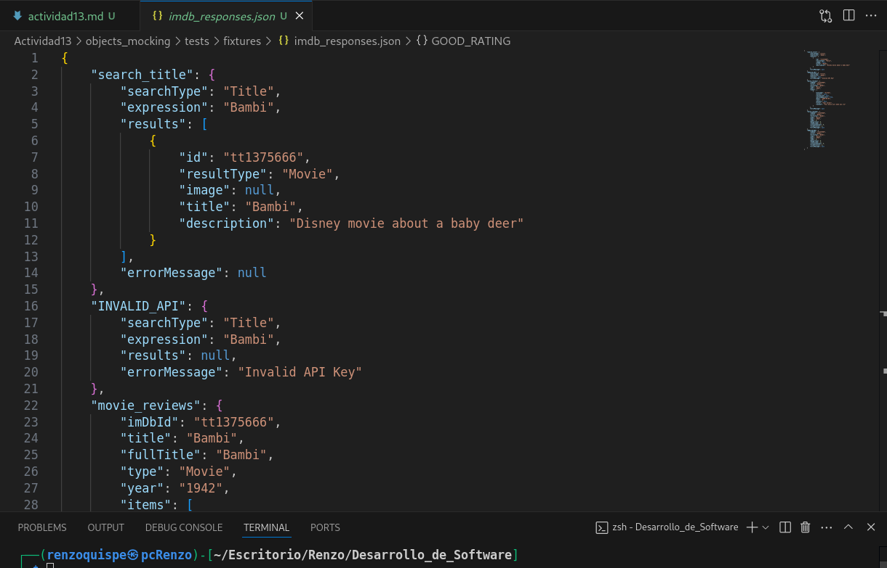
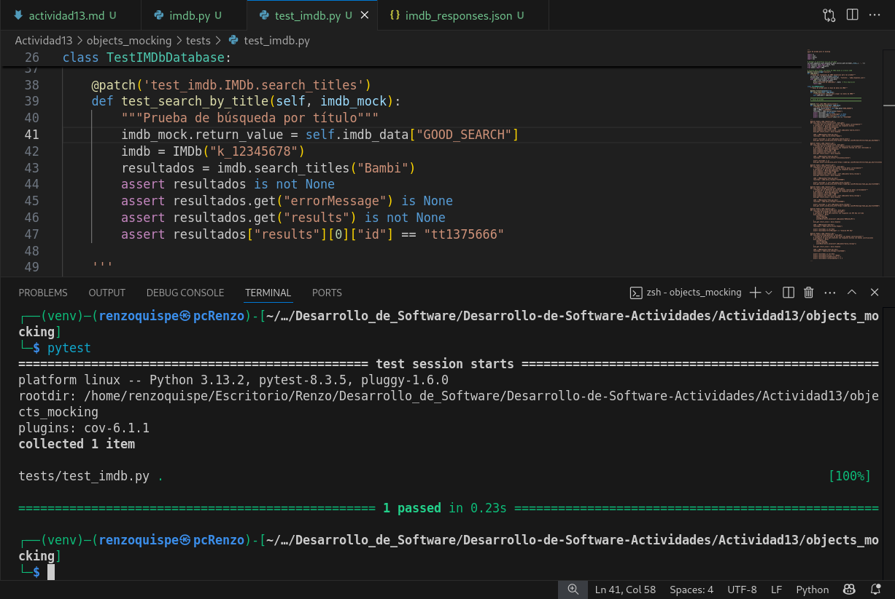
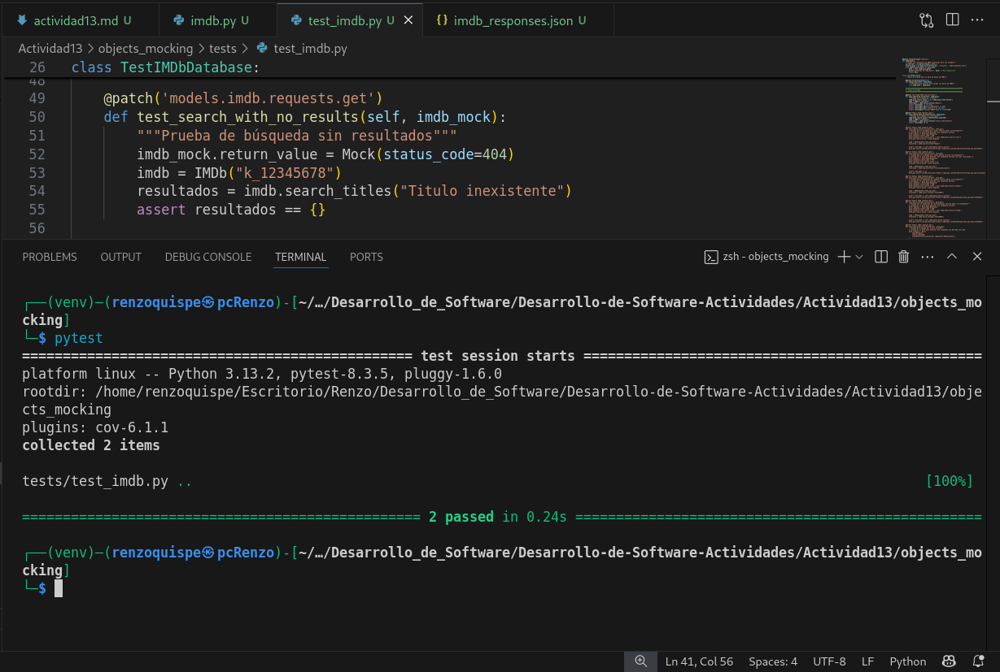
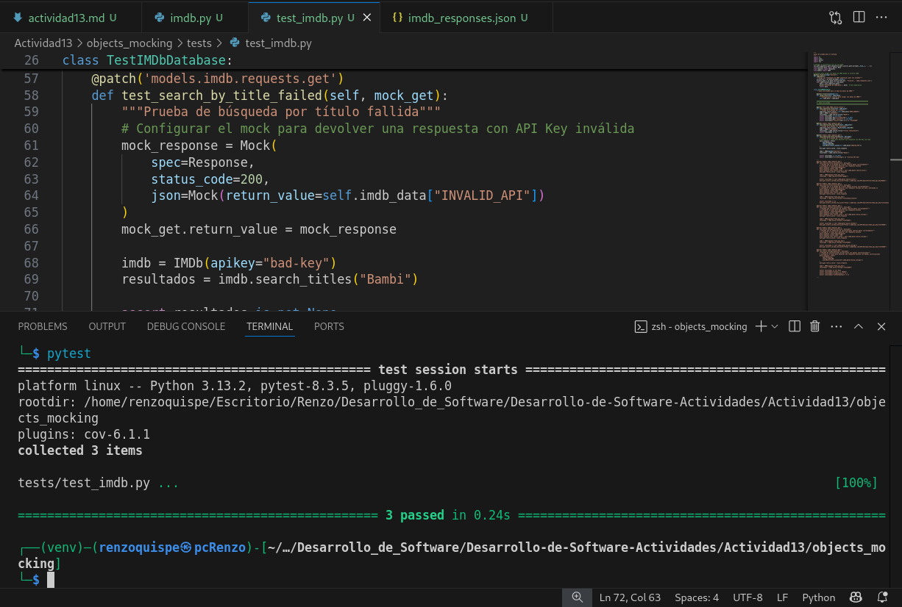
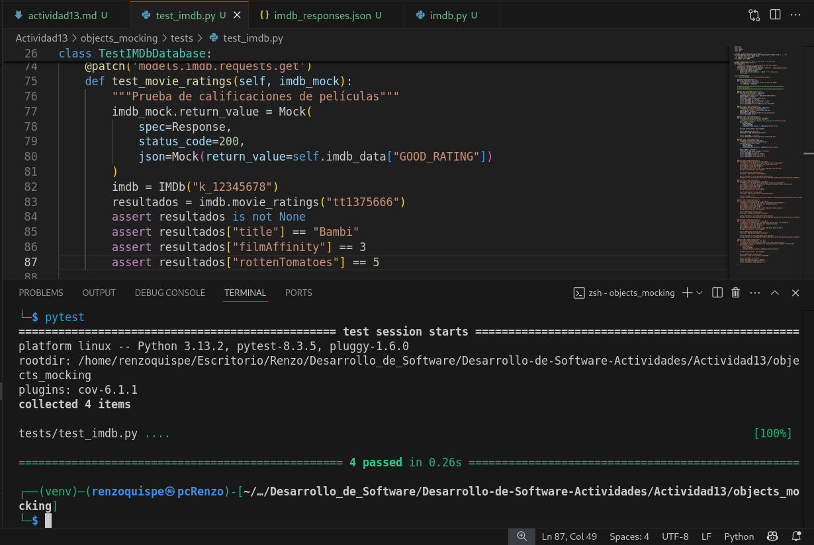
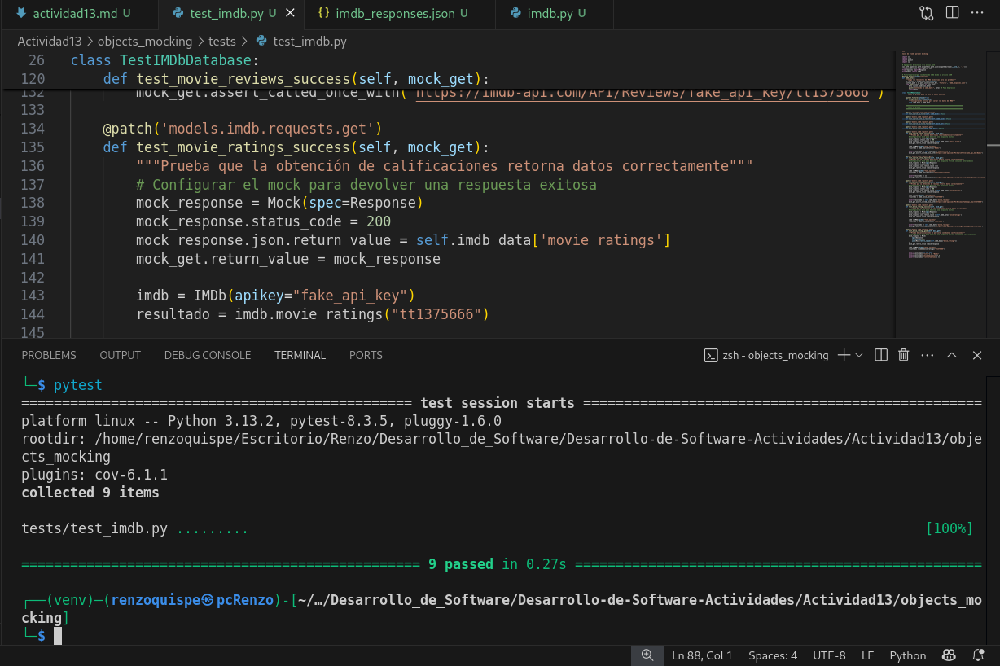

### Actividad 13: Objetos mocking

Bienvenido a la actividad de **objetos mocking**. Mocking es un proceso para crear objetos que imitan el comportamiento de objetos reales. Puede ser muy útil cuando tu código llama a otro sistema del cual depende y que podría no estar disponible durante las pruebas. Entender el mocking es crítico para asegurarse de que solo estás probando tu propio código, no el sistema de otra persona.

En esta actividad vamos a usar tanto patching como mocking para simular las llamadas reales al servicio de Internet Movie Database (IMDb) durante las pruebas. También utilizaremos fixtures de prueba para proporcionarnos respuestas válidas que hubiéramos recibido del servicio de IMDb si realmente lo hubiéramos llamado. De esta manera, podemos controlar lo que se devuelve del servicio sin tener que realizar una llamada real a él.

### Objetivos de aprendizaje

Después de completar esta actividad serás capaz de:

- Utilizar fixtures de prueba para cargar respuestas mock desde APIs reales.
- Entender cómo usar el decorador `patch` durante las pruebas.
- Utilizar la clase `Mock` para imitar el comportamiento de otros objetos.
- Escribir casos de prueba que parchean y mockean objetos retornados usando datos de fixtures de prueba.

#### Estableciendo fixtures de prueba

En la carpeta `tests/fixtures/` encontrarás un archivo llamado `imdb_responses.json`. Creamos este archivo llamando realmente a la API de IMDb y registrando las respuestas que regresaron. Luego, les asignamos un nombre a cada una y las colocamos en un archivo `json` para ser cargadas durante las pruebas.

También copiamos algunas respuestas y las modificamos para simular respuestas buenas y malas. Esperamos que puedas ver lo poderoso que es este concepto de controlar lo que se devuelve bajo condiciones de prueba. Puedes hacer que las respuestas hagan cualquier cosa que desees.

Abre el archivo `tests/fixtures/imdb_responses.json` en el IDE para familiarizarte con las diversas respuestas que utilizaremos en las pruebas.

#### La clase IMDb

En la carpeta `models/` encontrarás un archivo llamado `imdb.py`. Este módulo contiene la clase `IMDb` que vamos a probar. Implementa tres (3) de las muchas APIs que el servicio de IMDb expone. Actualmente, las APIs SearchTitle, Reviews y Ratings han sido implementadas por los métodos `search_titles()`, `movie_reviews()` y `movie_ratings()` respectivamente.

Abre el archivo `models/imdb.py` en el IDE para familiarizarte con los diversos métodos para llamarlo. Llamaremos a estos métodos en nuestras pruebas.


#### Los casos de prueba

En la carpeta `tests/` encontrarás un archivo llamado `test_imdb.py`. Este es el archivo al que agregaremos nuestros casos de prueba para probar la clase `IMDb`.

Abre el archivo `tests/test_imdb.py` en el editor del IDE. Trabajaremos en este archivo durante el resto del laboratorio.

#### Paso 1: Probar búsqueda por título

Comenzaremos implementando un caso de prueba para la búsqueda por título. A continuación se muestra el método de prueba que actualmente implementa la búsqueda por título sin ningún patching o mocking.

Copia y pega este código en `test_imdb.py` como la primera prueba, pero aún no lo ejecutes:

```python
def test_search_by_title():
    """Prueba de búsqueda por título"""
    imdb = IMDb("k_12345678")
    resultados = imdb.search_titles("Bambi")
    assert resultados is not None
    assert resultados.get("errorMessage") is None
    assert resultados.get("results") is not None
    assert resultados["results"][0]["id"] == "tt1375666"
```

> Nota: Este código instancia un objeto `IMDb` inicializándolo con una clave de API. Luego llama a `imdb.search_titles()` para la película "Bambi" y afirma que los resultados no son `None`. También verifica que el mensaje de error esté vacío y que el `id` retornado sea `tt1375666`.

Si tuvieras una clave de API real de IMDb, este código realmente llamaría al servicio de IMDb y devolvería una respuesta. Pero no queremos usar nuestra asignación de llamadas a la API en pruebas, por lo que parchearemos este método para que no llame al servicio en absoluto.

Queremos parchear el método `search_titles()` de la clase `IMDb` (es decir, `IMDb.search_titles()`) para que no se llame en absoluto. Para esto usaremos el decorador `@patch()` y parchearemos el `return_value` para que retorne el fixture de prueba `GOOD_SEARCH`.

En `test_imdb.py`, agrega la siguiente línea de código antes del método `test_search_by_title()` y agrega un parámetro para el nuevo mock llamado `imdb_mock`.

```python
from unittest.mock import patch

@patch('test_imdb.IMDb.search_titles')
def test_search_by_title(imdb_mock):
    """Prueba de búsqueda por título"""
    imdb_mock.return_value = IMDB_DATA["GOOD_SEARCH"]
    imdb = IMDb("k_12345678")
    resultados = imdb.search_titles("Bambi")
    assert resultados is not None
    assert resultados.get("errorMessage") is None
    assert resultados.get("results") is not None
    assert resultados["results"][0]["id"] == "tt1375666"
```

> Nota: Esto está parcheando `test_imdb.IMDb.search_titles`. El nombre de nuestro módulo de prueba es `test_imdb`, por lo que queremos parchear la clase `IMDb` que importamos, no la que está en el paquete `models`. Este es un concepto importante de entender. Siempre quieres parchear la función que está dentro del espacio de nombres que estás probando. Por eso necesitas calificar completamente `IMDb.search_titles` como `test_imdb.IMDb.search_titles`.

#### Solución al paso 1

```python
import json
import pytest
from unittest.mock import patch, Mock
from models.imdb import IMDb

# Fixture para cargar los datos de IMDb desde un archivo JSON
@pytest.fixture(scope="session")
def imdb_data():
    """Carga las respuestas de IMDb necesarias para las pruebas"""
    with open('tests/fixtures/imdb_responses.json') as json_data:
        return json.load(json_data)

class TestIMDbDatabase:
    """Casos de prueba para la base de datos de IMDb"""

    @pytest.fixture(autouse=True)
    def setup_class(self, imdb_data):
        """Configuración inicial para cargar los datos de IMDb"""
        self.imdb_data = imdb_data

    ######################################################################
    #  Casos de prueba
    ######################################################################

    @patch('test_imdb.IMDb.search_titles')
    def test_search_by_title(self, imdb_mock):
        """Prueba de búsqueda por título"""
        imdb_mock.return_value = self.imdb_data["GOOD_SEARCH"]
        imdb = IMDb("k_12345678")
        resultados = imdb.search_titles("Bambi")
        assert resultados is not None
        assert resultados.get("errorMessage") is None
        assert resultados.get("results") is not None
        assert resultados["results"][0]["id"] == "tt1375666"
```
- Ejecutamos los tests


#### Paso 2: Búsqueda sin resultados

Ahora vamos a incrementar la complejidad de lo que parcheamos y mockeamos. Esta siguiente prueba es un "camino triste". Probará una llamada que no retorna resultados.

Comienza cortando y pegando la versión no parcheada del método `test_search_with_no_results()` en `test_imdb.py`. Aquí está el código para copiar:

```python
def test_search_with_no_results():
    """Prueba de búsqueda sin resultados"""
    imdb = IMDb("k_12345678")
    resultados = imdb.search_titles("TituloInexistente")
    assert resultados == {}
```

> Nota: Esto instancia una nueva instancia de IMDb con una clave de API y luego llama a `imdb.search_titles("TituloInexistente")` y afirma que devuelve un diccionario vacío `{}`. Eso no es muy probable a menos que puedas hacer que el servicio de IMDb falle... pero ¡podemos simular esa falla con un mock!

En `test_imdb.py`, agrega la siguiente línea de código antes del método `test_search_with_no_results()` y agrega un parámetro para el nuevo mock llamado `imdb_mock`. Esto parchea la llamada a `requests.get()` y nos permite controlar lo que regresa usando la variable `imdb_mock`.

```python
@patch('models.imdb.requests.get')
def test_search_with_no_results(imdb_mock):
    """Prueba de búsqueda sin resultados"""
    imdb_mock.return_value = Mock(status_code=404)
    imdb = IMDb("k_12345678")
    resultados = imdb.search_titles("TituloInexistente")
    assert resultados == {}
```

> Nota: Esta vez estamos parcheando una biblioteca de terceros llamada `requests`. Pero no es el paquete `requests` que hemos importado en nuestro módulo de prueba. Es el paquete `requests` en el módulo `imdb` (`models.imdb.requests.get`). Específicamente, estamos parcheando la función `get` porque sabemos que `IMDb.search_titles()` eventualmente llamará al método `requests.get()` para hacer la llamada a la API de IMDb. Queremos interceptar (o parchear) esa llamada para controlar lo que se devuelve.

#### Solución al paso 2

```python
    @patch('models.imdb.requests.get')
    def test_search_with_no_results(self, imdb_mock):
        """Prueba de búsqueda sin resultados"""
        imdb_mock.return_value = Mock(status_code=404)
        imdb = IMDb("k_12345678")
        resultados = imdb.search_titles("Titulo inexistente")
        assert resultados == {}
```
- Ejecutamos los tests


#### Paso 3: Búsqueda por título fallida

A continuación, construiremos otro caso de prueba de falla, pero esta vez necesitamos un Mock que se comporte como un objeto `Response` del paquete `requests`. Retornaremos un código de retorno bueno de `200`, pero estamos simulando el uso de una clave de API inválida, por lo que necesitamos un mensaje de error específico retornado. Afortunadamente, tenemos uno en nuestros datos de fixture de prueba.

Comencemos cortando y pegando la versión no parcheada del método `test_search_by_title_failed()` en `test_imdb.py`. Aquí está el código para copiar:

```python
def test_search_by_title_failed():
    """Prueba de búsqueda por título fallida"""
    imdb = IMDb("bad-key")
    resultados = imdb.search_titles("Bambi")
    assert resultados is not None
    assert resultados["errorMessage"] == "Invalid API Key"
```

> Nota: Esto instancia una nueva instancia de IMDb pasando una clave de API inválida, y luego llama a `imdb.search_titles("Bambi")` y afirma que devuelve un mensaje de error de _"Invalid API Key"_.

En `test_imdb.py`, agrega la siguiente línea de código antes del método `test_search_by_title_failed()` y agrega un parámetro para el nuevo mock llamado `imdb_mock`. Esto parchea la llamada a `requests.get()` y nos permite controlar lo que regresa usando la variable `imdb_mock`.

```python
@patch('models.imdb.requests.get')
def test_search_by_title_failed(imdb_mock):
    """Prueba de búsqueda por título fallida"""
    imdb_mock.return_value = Mock(
        spec=Response,
        status_code=200,
        json=Mock(return_value=IMDB_DATA["INVALID_API"])
    )
    imdb = IMDb("bad-key")
    resultados = imdb.search_titles("Bambi")
    assert resultados is not None
    assert resultados["errorMessage"] == "Invalid API Key"
```

> Nota: Estamos parcheando el `return_value` de la llamada `requests.get()` con un objeto `Mock` que tiene un atributo llamado `status_code` configurado en `200`. Si miramos el código fuente de `IMDb.search_titles()`, veremos que después de llamar a `requests.get()`, verifica que el `status_code` sea `200` y, si lo es, llama a `request.json()` para obtener la carga útil. Por lo tanto, también debemos mockear la llamada a `json()` y retornar la carga útil que queremos.

#### Solución al paso 3

```python
    @patch('models.imdb.requests.get')
    def test_search_by_title_failed(self, imdb_mock):
        """Prueba de búsqueda por título fallida"""
        imdb_mock.return_value = Mock(
            spec=Response,
            status_code=200, 
            json=Mock(return_value=self.imdb_data["INVALID_API"])
        )
        imdb = IMDb("bad-key")
        resultados = imdb.search_titles("Bambi")
        assert resultados is not None
        assert resultados["errorMessage"] == "Invalid API Key"
```
- Ejecutamos los test

#### Paso 4: Probar calificaciones de películas

En este paso final, vamos a probar la llamada a calificaciones de películas. Dado que no queremos llamar a la base de datos real de IMDb durante las pruebas, nuevamente mockearemos la llamada a `requests.get()` y sustituiremos nuestra propia respuesta de calificaciones de películas desde nuestros datos de fixture de prueba.

Esperamos que puedas ver que al parchear la llamada remota, podemos probar el resto del código de la función antes y después de la llamada para asegurarnos de que se comporte correctamente bajo todo tipo de condiciones de prueba.

Comencemos cortando y pegando la versión no parcheada del método `test_movie_ratings()` en `test_imdb.py`. Aquí está el código para copiar:

```python
def test_movie_ratings():
    """Prueba de calificaciones de películas"""
    imdb = IMDb("k_12345678")
    resultados = imdb.movie_ratings("tt1375666")
    assert resultados is not None
    assert resultados["title"] == "Bambi"
    assert resultados["filmAffinity"] == 3
    assert resultados["rottenTomatoes"] == 5
```

> Nota: Esto instancia una nueva instancia de IMDb pasando una clave de API. Luego llama a `imdb.movie_ratings({id})` pasando un ID de película. Finalmente, afirma que los resultados no son `None` y verifica algunas de las calificaciones para asegurarse de que son los datos correctos.

En `test_imdb.py`, agrega la siguiente línea de código antes del método `test_movie_ratings()` y agrega un parámetro para el nuevo mock llamado `imdb_mock`. Esto parchea la llamada a `requests.get()` y nos permite controlar lo que regresa usando la variable `imdb_mock`.

```python
@patch('models.imdb.requests.get')
def test_movie_ratings(imdb_mock):
    """Prueba de calificaciones de películas"""
    imdb_mock.return_value = Mock(
        spec=Response,
        status_code=200,
        json=Mock(return_value=IMDB_DATA["GOOD_RATING"])
    )
    imdb = IMDb("k_12345678")
    resultados = imdb.movie_ratings("tt1375666")
    assert resultados is not None
    assert resultados["title"] == "Bambi"
    assert resultados["filmAffinity"] == 3
    assert resultados["rottenTomatoes"] == 5
```

> Nota: Nuevamente, estamos parcheando la función de biblioteca de terceros `requests.get()` y creando una variable llamada `imdb_mock` que nos permite controlar cómo se comporta el parche. Enviamos de vuelta un código de retorno bueno de `200`, lo que hará que el método `IMDb.movie_ratings()` llame a `request.json()`. Para engañar a `movie_ratings()` y hacerle creer que recibió un objeto real `requests.Response`, debemos usar `spec=Response` al crear el mock para que se comporte como la clase real `Response`.

#### Solución al paso 4

```python
    @patch('models.imdb.requests.get')
    def test_movie_ratings(self, imdb_mock):
        """Prueba de calificaciones de películas"""
        imdb_mock.return_value = Mock(
            spec=Response,
            status_code=200, 
            json=Mock(return_value=self.imdb_data["GOOD_RATING"])
        )
        imdb = IMDb("k_12345678")
        resultados = imdb.movie_ratings("tt1375666")
        assert resultados is not None
        assert resultados["title"] == "Bambi"
        assert resultados["filmAffinity"] == 3
        assert resultados["rottenTomatoes"] == 5
```

---
- Ejecutamos los test


- Coverage


#### Solución Completa: `test_imdb.py`

A continuación se presenta la versión completa del archivo `test_imdb.py` con todos los casos de prueba implementados utilizando mocking y patching.
(Modifica o corrigue si fuese necesario)

```python
"""
Casos de prueba para Mocking Lab
"""
import os
import json
import pytest
import sys

# Agregar el directorio raíz al sys.path
sys.path.append(os.path.abspath(os.path.join(os.path.dirname(__file__), '..')))
from unittest.mock import patch, Mock
from requests import Response
from models import IMDb

# Fixture para cargar los datos de IMDb desde un archivo JSON
@pytest.fixture(scope="session")
def imdb_data():
    """Carga las respuestas de IMDb necesarias para las pruebas"""
    current_dir = os.path.dirname(__file__)
    fixture_path = os.path.join(current_dir, 'fixtures', 'imdb_responses.json')
    with open(fixture_path) as json_data:
        data = json.load(json_data)
        print("Contenido de imdb_data:", data)  # Para depuración
        return data

class TestIMDbDatabase:
    """Casos de prueba para la base de datos de IMDb"""

    @pytest.fixture(autouse=True)
    def setup_class(self, imdb_data):
        """Configuración inicial para cargar los datos de IMDb"""
        self.imdb_data = imdb_data

    ######################################################################
    #  Casos de prueba
    ######################################################################

    @patch('models.imdb.requests.get')
    def test_search_titles_success(self, mock_get):
        """Prueba que la búsqueda de títulos retorna datos correctamente"""
        # Configurar el mock para devolver una respuesta exitosa
        mock_response = Mock(spec=Response)
        mock_response.status_code = 200
        mock_response.json.return_value = self.imdb_data['search_title']
        mock_get.return_value = mock_response

        imdb = IMDb(apikey="fake_api_key")
        resultado = imdb.search_titles("Bambi")

        assert resultado == self.imdb_data['search_title']
        mock_get.assert_called_once_with("https://imdb-api.com/API/SearchTitle/fake_api_key/Bambi")

    @patch('models.imdb.requests.get')
    def test_search_titles_failure(self, mock_get):
        """Prueba que la búsqueda de títulos maneja errores correctamente"""
        # Configurar el mock para devolver una respuesta fallida con json retornando {}
        mock_response = Mock(spec=Response)
        mock_response.status_code = 404
        mock_response.json.return_value = {}
        mock_get.return_value = mock_response

        imdb = IMDb(apikey="fake_api_key")
        resultado = imdb.search_titles("TituloInexistente")

        assert resultado == {}
        mock_get.assert_called_once_with("https://imdb-api.com/API/SearchTitle/fake_api_key/TituloInexistente")

    @patch('models.imdb.requests.get')
    def test_movie_reviews_success(self, mock_get):
        """Prueba que la obtención de reseñas retorna datos correctamente"""
        # Configurar el mock para devolver una respuesta exitosa
        mock_response = Mock(spec=Response)
        mock_response.status_code = 200
        mock_response.json.return_value = self.imdb_data['movie_reviews']
        mock_get.return_value = mock_response

        imdb = IMDb(apikey="fake_api_key")
        resultado = imdb.movie_reviews("tt1375666")

        assert resultado == self.imdb_data['movie_reviews']
        mock_get.assert_called_once_with("https://imdb-api.com/API/Reviews/fake_api_key/tt1375666")

    @patch('models.imdb.requests.get')
    def test_movie_ratings_success(self, mock_get):
        """Prueba que la obtención de calificaciones retorna datos correctamente"""
        # Configurar el mock para devolver una respuesta exitosa
        mock_response = Mock(spec=Response)
        mock_response.status_code = 200
        mock_response.json.return_value = self.imdb_data['movie_ratings']
        mock_get.return_value = mock_response

        imdb = IMDb(apikey="fake_api_key")
        resultado = imdb.movie_ratings("tt1375666")

        assert resultado == self.imdb_data['movie_ratings']
        mock_get.assert_called_once_with("https://imdb-api.com/API/Ratings/fake_api_key/tt1375666")

    @patch('models.imdb.requests.get')
    def test_search_by_title_failed(self, mock_get):
        """Prueba de búsqueda por título fallida"""
        # Configurar el mock para devolver una respuesta con API Key inválida
        mock_response = Mock(
            spec=Response,
            status_code=200,
            json=Mock(return_value=self.imdb_data["INVALID_API"])
        )
        mock_get.return_value = mock_response

        imdb = IMDb(apikey="bad-key")
        resultados = imdb.search_titles("Bambi")

        assert resultados is not None
        assert resultados["errorMessage"] == "Invalid API Key"

    @patch('models.imdb.requests.get')
    def test_movie_ratings_good(self, mock_get):
        """Prueba de calificaciones de películas con buenas calificaciones"""
        # Configurar el mock para devolver una respuesta exitosa con buenas calificaciones
        mock_response = Mock(
            spec=Response,
            status_code=200,
            json=Mock(return_value=self.imdb_data["movie_ratings"])
        )
        mock_get.return_value = mock_response

        imdb = IMDb(apikey="fake_api_key")
        resultados = imdb.movie_ratings("tt1375666")

        assert resultados is not None
        assert resultados["title"] == "Bambi"
        assert resultados["filmAffinity"] == 3
        assert resultados["rottenTomatoes"] == 5
```


Esperamos que estés viendo el patrón con el mocking. Primero, usas el decorador `@patch()` para envolver tu caso de prueba con un parche que cambiará el comportamiento de una llamada a función que eventualmente se llamará durante la prueba. Luego, agregas un nuevo parámetro a la llamada del método de prueba que representa el objeto parcheado. Finalmente, usas ese parámetro para parchear ya sea el `return_value` o `side_effect` que cambiará el comportamiento de la función parcheada.

También aprendiste cómo usar objetos Mock para imitar otras clases como la clase `Response`, para controlar cómo se comportan y qué retornan. Incluso mockeaste la función `json()` en la clase `Response` mockeada para controlar lo que retornaba.

Tu próximo desafío es aplicar estas técnicas en tus proyectos para mockear cualquier dependencia externa durante las pruebas, de manera que puedas estar seguro de que estás probando el comportamiento de tu propio código, y no el servicio de otra persona.

- Coverage final

- Ejecucion de los tests
