### Actividad 16: Práctica del ciclo TDD

#### 1. Estructura de los archivos de ejemplo

El repositorio de referencia contiene:

- **`counter.py`**  
  Implementa una aplicación Flask que gestiona contadores en memoria (diccionario Python).
- **`status.py`**  
  Define constantes para códigos HTTP (`HTTP_200_OK`, `HTTP_201_CREATED`, etc.).
- **`tests_counters.py`**  
  Pruebas Pytest que validan las rutas CRUD: creación, lectura, actualización y eliminación.

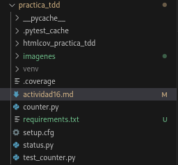

Rutas disponibles en `counter.py`:

- **`POST   /counters/<name>`**  Crear un nuevo contador con valor inicial 0.  
- **`GET    /counters/<name>`**  Obtener el valor actual de un contador.  
- **`PUT    /counters/<name>`**  Actualizar (incrementar) el valor de un contador.  
- **`DELETE /counters/<name>`**  Eliminar un contador existente.  

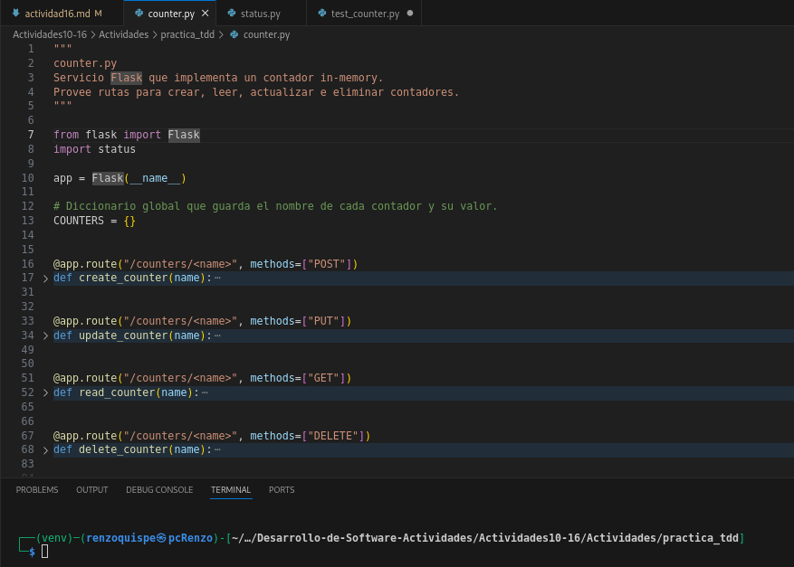

#### 2. Desarrollo paso a paso (TDD)

En cada operación seguimos el ciclo:  
1. **Red →** escribir la prueba que falla.  
2. **Green →** implementar lo mínimo para pasar la prueba.  
3. **Refactor →** mejorar el diseño sin alterar el comportamiento.

##### 2.1. Actualizar un contador (PUT)

**Paso 1: Prueba (Red)**  
```python
def test_update_counter(client):
    """Debe incrementar el contador y devolver 200 OK."""
    # 1. Crear contador
    response = client.post("/counters/update_me")
    assert response.status_code == HTTPStatus.CREATED
    assert response.get_json()["update_me"] == 0

    # 2. Incrementar
    response = client.put("/counters/update_me")
    assert response.status_code == HTTPStatus.OK
    assert response.get_json()["update_me"] == 1
```

**Paso 2: Implementación (Green)**  
```python
@app.route("/counters/<name>", methods=["PUT"])
def update_counter(name):
    global COUNTERS
    if name not in COUNTERS:
        return {"message": f"El contador '{name}' no existe"}, status.HTTP_404_NOT_FOUND
    COUNTERS[name] += 1
    return {name: COUNTERS[name]}, status.HTTP_200_OK
```

**Paso 3: Refactor**  
- Extraer la validación de existencia a un decorador `@require_counter`.  
- Mantener el cuerpo de la función limpio de lógica repetida.

```python
# En counter.py, al inicio:
from functools import wraps

def require_counter(f):
    @wraps(f)
    def wrapper(name, *args, **kwargs):
        if name not in COUNTERS:
            return {"message": f"El contador '{name}' no existe"}, status.HTTP_404_NOT_FOUND
        return f(name, *args, **kwargs)
    return wrapper

# Ruta refactorizada:
@app.route("/counters/<name>", methods=["PUT"])
@require_counter
def update_counter(name):
    COUNTERS[name] += 1
    return {name: COUNTERS[name]}, status.HTTP_200_OK
```

- Ejecucion de test
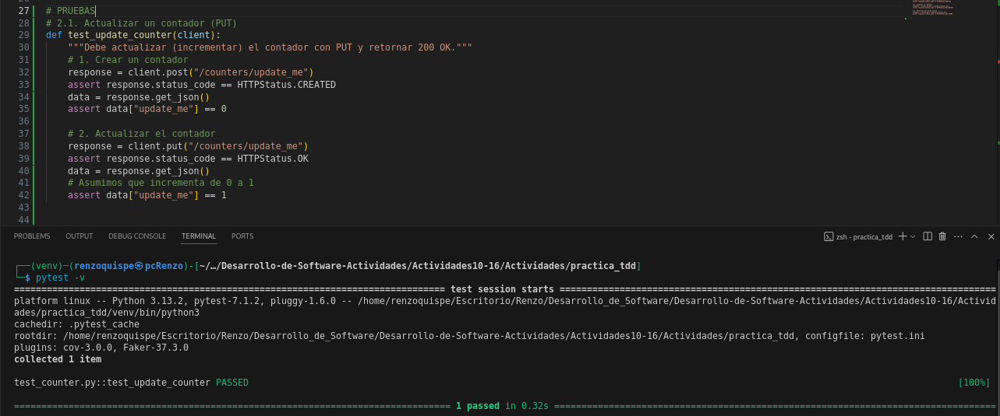

##### 2.2. Leer un contador (GET)

**Paso 1: Prueba (Red)**  
```python
def test_read_counter(client):
    """Debe devolver el valor actual y 200 OK."""
    client.post("/counters/read_me")
    response = client.get("/counters/read_me")
    assert response.status_code == HTTPStatus.OK
    assert response.get_json()["read_me"] == 0
```

**Paso 2: Implementación (Green)**  
```python
@app.route("/counters/<name>", methods=["GET"])
def read_counter(name):
    global COUNTERS
    if name not in COUNTERS:
        return {"message": f"El contador '{name}' no existe"}, status.HTTP_404_NOT_FOUND
    return {name: COUNTERS[name]}, status.HTTP_200_OK
```

**Paso 3: Refactor**  
- Aplicar `@require_counter` para eliminar la comprobación manual.

```python
@app.route("/counters/<name>", methods=["GET"])
@require_counter
def read_counter(name):
    return {name: COUNTERS[name]}, status.HTTP_200_OK
```

- Ejecucion de los tests
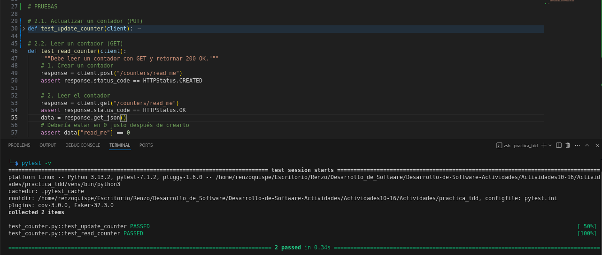

##### 2.3. Eliminar un contador (DELETE)

**Paso 1: Prueba (Red)**  
```python
def test_delete_counter(client):
    """Debe eliminar el contador y devolver 204 NO CONTENT."""
    client.post("/counters/delete_me")
    response = client.delete("/counters/delete_me")
    assert response.status_code == HTTPStatus.NO_CONTENT

    # Confirmar que ya no existe
    response = client.get("/counters/delete_me")
    assert response.status_code == HTTPStatus.NOT_FOUND
```

**Paso 2: Implementación (Green)**  
```python
@app.route("/counters/<name>", methods=["DELETE"])
def delete_counter(name):
    global COUNTERS
    if name not in COUNTERS:
        return {"message": f"El contador '{name}' no existe"}, status.HTTP_404_NOT_FOUND
    del COUNTERS[name]
    return "", status.HTTP_204_NO_CONTENT
```

**Paso 3: Refactor**  
- Reutilizar `@require_counter` y unificar patrón de respuesta.

```python
@app.route("/counters/<name>", methods=["DELETE"])
@require_counter
def delete_counter(name):
    del COUNTERS[name]
    return "", status.HTTP_204_NO_CONTENT
```

- Ejecucion de los tests
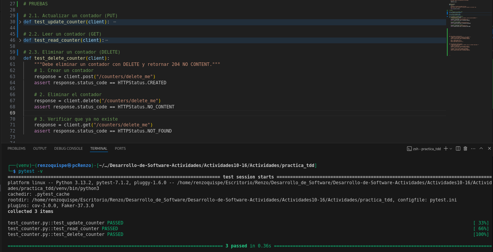

- Coverage actual
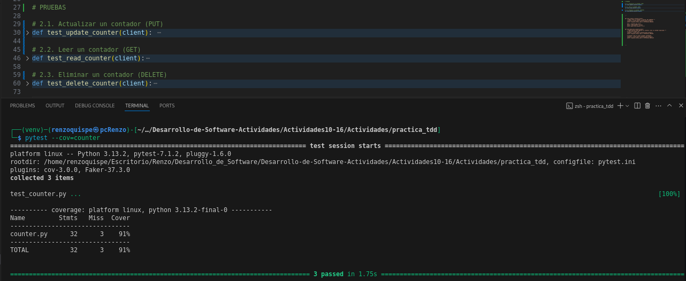


#### 3. Ejercicios adicionales

##### 3.1. Incrementar un contador (ruta dedicada)

1. **Prueba (Red):**  
   ```python
   def test_increment_counter(client):
       client.post("/counters/my_counter")
       response = client.put("/counters/my_counter/increment")
       assert response.status_code == HTTPStatus.OK
       assert response.get_json()["my_counter"] == 1
   ```
2. **Implementación (Green):**  
   ```python
   def change_counter(name, delta):
       COUNTERS[name] += delta
       return {name: COUNTERS[name]}

   @app.route("/counters/<name>/increment", methods=["PUT"])
   @require_counter
   def increment_counter(name):
       return change_counter(name, +1), status.HTTP_200_OK
   ```
3. **Refactor:**  
   - `change_counter` ya centraliza la lógica de ajuste de valor.

- Ejecucion de los tests
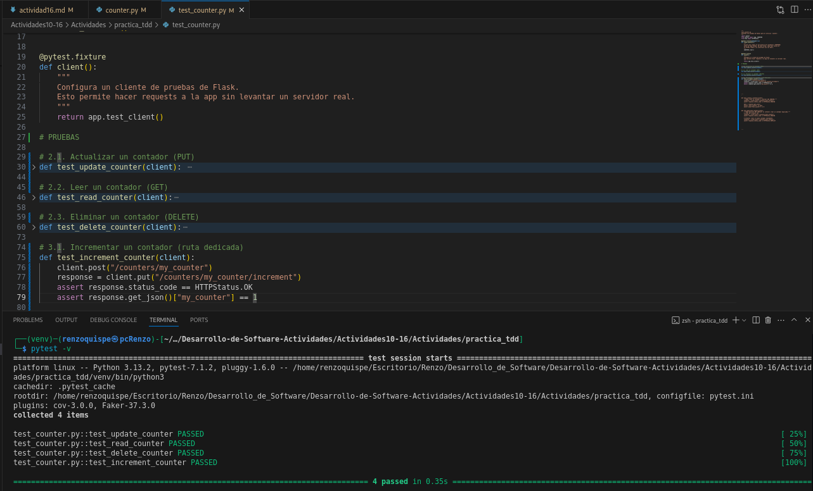

##### 3.2. Establecer valor específico

1. **Prueba (Red):**  
   ```python
   def test_set_counter(client):
       client.post("/counters/custom")
       response = client.put("/counters/custom/set", json={"value": 10})
       assert response.status_code == HTTPStatus.OK
       assert response.get_json()["custom"] == 10
   ```
2. **Implementación (Green):**  
   ```python
   @app.route("/counters/<name>/set", methods=["PUT"])
   @require_counter
   def set_counter(name):
       body = request.get_json()
       COUNTERS[name] = body.get("value", COUNTERS[name])
       return {name: COUNTERS[name]}, status.HTTP_200_OK
   ```
3. **Refactor:**  
   - Validar que `body["value"]` sea entero y ≥0; elevar 400 BAD REQUEST si no.

- Ejecucion de los tests
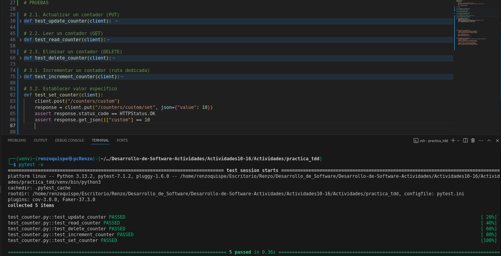

##### 3.3. Listar todos los contadores

1. **Prueba (Red):**  
   ```python
   def test_list_counters(client):
       client.post("/counters/a")
       client.post("/counters/b")
       response = client.get("/counters")
       assert response.status_code == HTTPStatus.OK
       data = response.get_json()
       assert set(data.keys()) == {"a", "b"}
   ```
2. **Implementación (Green):**  
   ```python
   @app.route("/counters", methods=["GET"])
   def list_counters():
       return COUNTERS, status.HTTP_200_OK
   ```
3. **Refactor:**  
   - Ninguno necesario si es sencillo; considerar paginación o filtros.


- Ejecucion de los tests
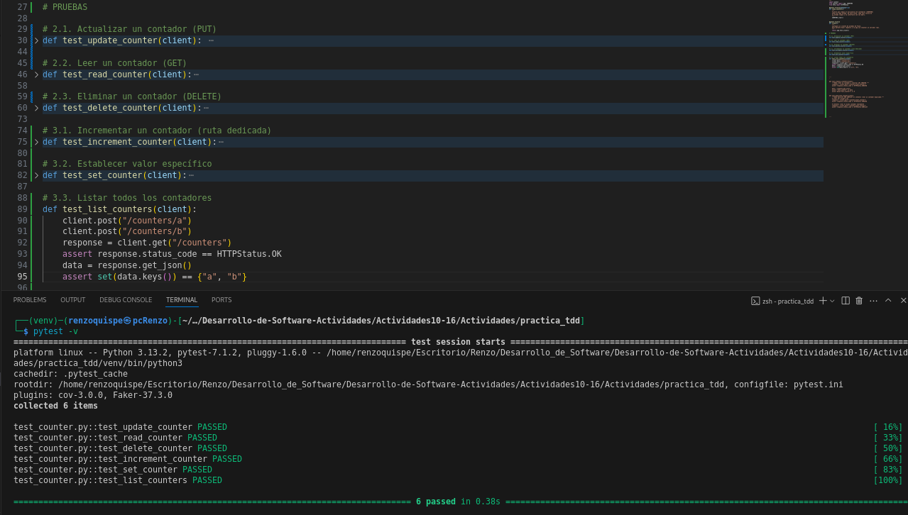

##### 3.4. Reiniciar un contador

1. **Prueba (Red):**  
   ```python
   def test_reset_counter(client):
       client.post("/counters/tmp")
       client.put("/counters/tmp")
       response = client.put("/counters/tmp/reset")
       assert response.status_code == HTTPStatus.OK
       assert response.get_json()["tmp"] == 0
   ```
2. **Implementación (Green):**  
   ```python
   @app.route("/counters/<name>/reset", methods=["PUT"])
   @require_counter
   def reset_counter(name):
       COUNTERS[name] = 0
       return {name: COUNTERS[name]}, status.HTTP_200_OK
   ```
3. **Refactor:**  
   - Reutilizar `change_counter` con delta = –current value, si se desea.

- Ejecucion de los tests
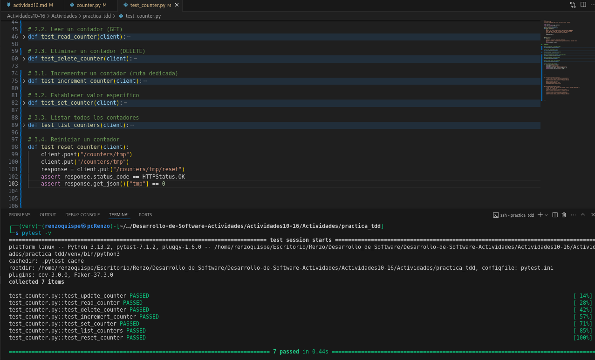

- Coverage actual


- Ultimos test: test_create_a_counter y test_duplicate_counter

- Coverage final
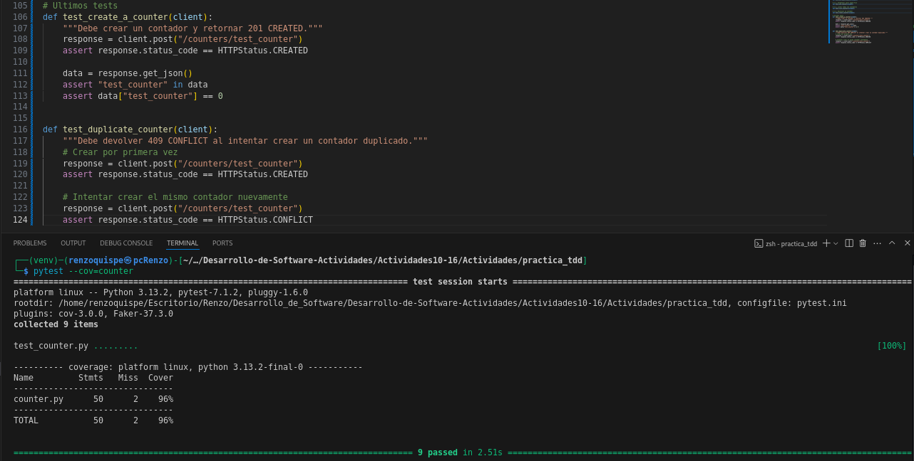