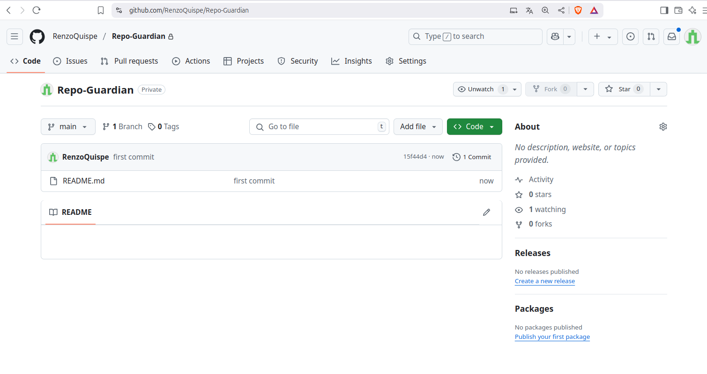
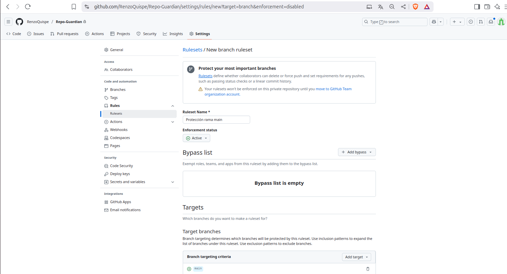
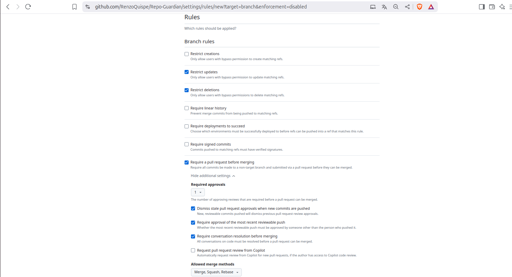
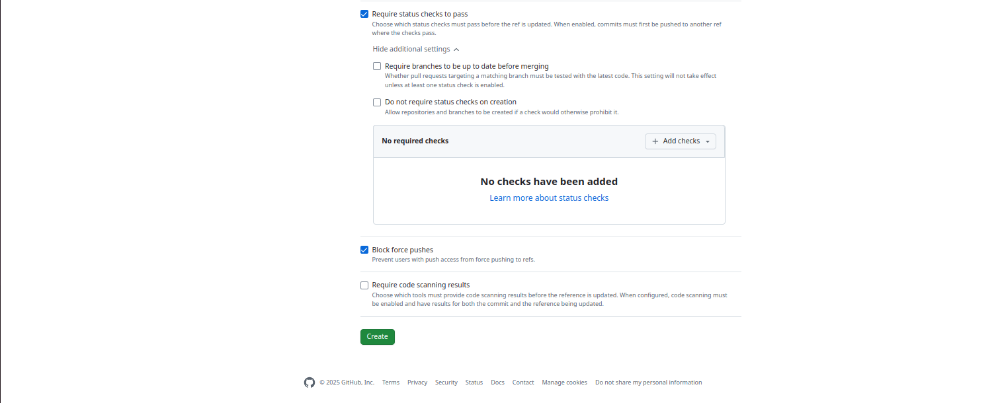
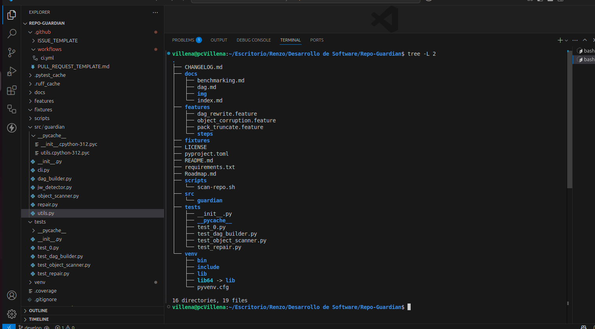
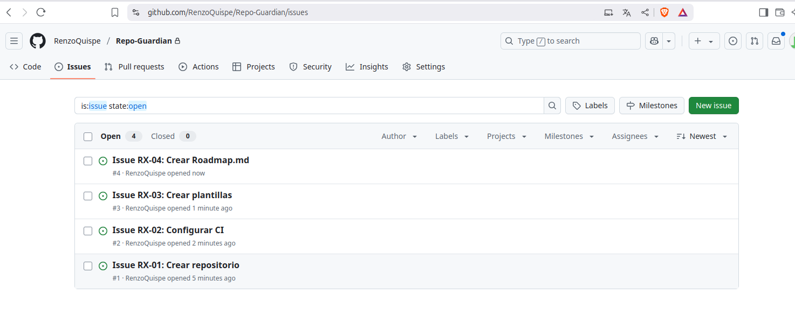
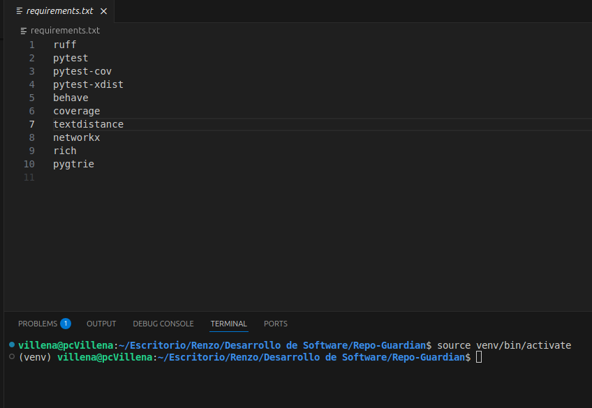
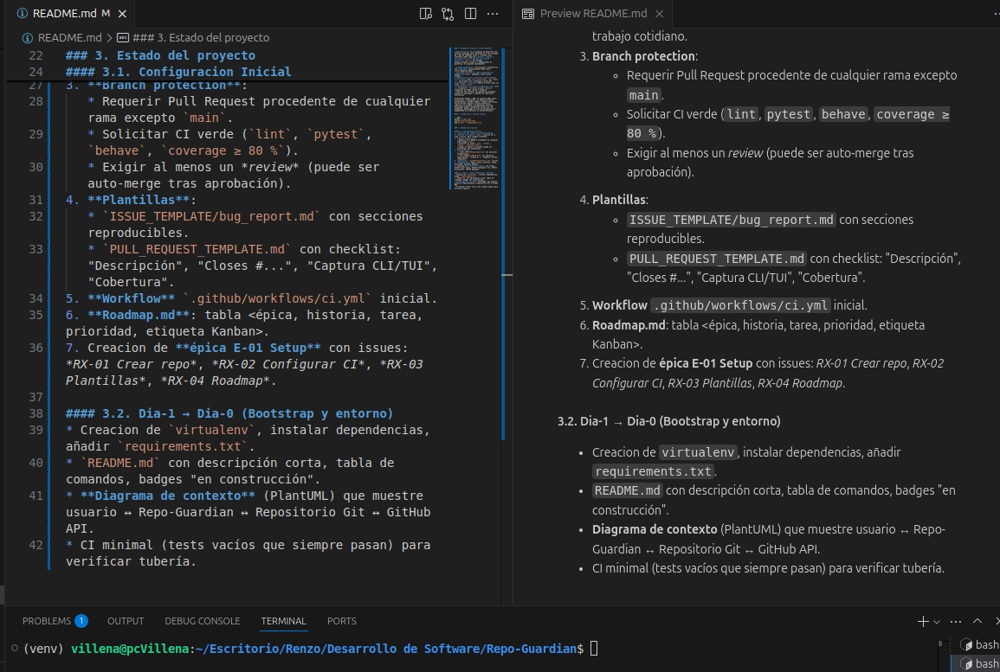
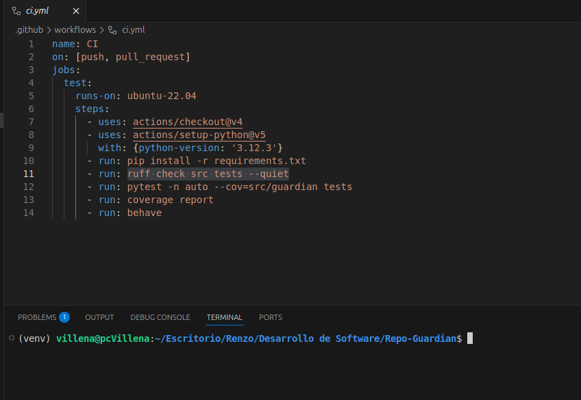
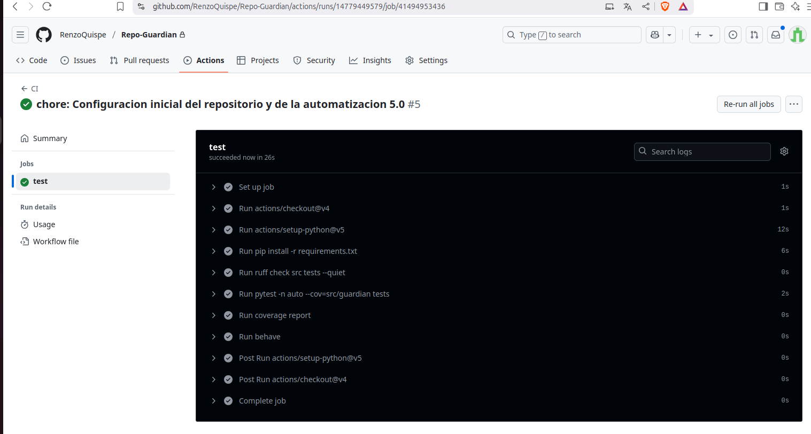

[Repositorio Repo-Guardian](https://github.com/RenzoQuispe/Repo-Guardian)
### Practica Calificada 1: **Repo-Guardian**  

> Esta actividad acompaña a la evaluación dada el 28 de abril según las rúbricas mencionadas en el curso.

#### 1. Propósito, alcance y líneas maestras  

**Repo-Guardian** es un proyecto de desarrollo de software avanzada cuyo resultado será una utilidad de línea de comandos (CLI) y  terminal user interface (TUI) capaz de **auditar, reparar y re-lineralizar la integridad de cualquier directorio `.git`**, ya contenga
objetos sueltos ("loose") o empaquetados en packfiles. El programa implementará:  

* **Árbol de Merkle** y verificación criptográfica con **SHA-256** (opcionalmente SHA-1 para retro-compatibilidad).  
* **Búsqueda binaria de commits defectuosos** usando `git bisect` embebido y heurísticas propias.  
* **Reconstrucción de historiales potencialmente re-escritos** (caso `git filter-repo`, `git rebase -i`, force-push, etc.) mediante cálculo del **Jaro–Winkler distance** (umbral ≥ 0,92) sobre las rutas `commit → root`.  
* **Exportación de un grafo dirigido acíclico (DAG)**; se generará `recovered.graphml` para su inspección en Gephi, Neo4j o Graphviz.  
* Interfaz TUI (curses) con paneles de progreso, resumen de hallazgos y comandos de reparación interactiva.  

Orientación DevOps / BDD: el proyecto debe nacer, evolucionar y entregarse con *good practices* profesionales: tablero Kanban, commits semánticos, flujos de Pull Request, branch-protection, cobertura de pruebas, documentación continua, etiquetado semver, generación automática  de changelog, despliegue de site de documentación y empaquetado de artefactos en GitHub Releases.

#### 2. Núcleo algorítmico y estructura de datos requerida  

| Paso del pipeline | Descripción detenida | Estructura usada | Complejidad esperada |
|-------------------|----------------------|------------------|----------------------|
| 1. *Scan & Inflate* | Leer archivos bajo `.git/objects`, detectar si es *loose* (2 + 38 bytes) o entrada de packfile; descomprimir `zlib`, extraer cabecera `"<type> <size>\0"`, recalcular hash y contrastar con nombre. | Buffer binario + tabla hash (`dict`) → O(1) acceso | O(n) sobre número de objetos `n` |
| 2. *Build DAG* | Con cada `commit` válido insertar vértice en un dict → lista de padres; recorrer con BFS para establecer orden topológico y **generation number (GN)**. | `defaultdict[list]` + cola BFS | O(V + E) |
| 3. *Detect rewrites* | Para cada punta encontrada calcular string de hashes desde él hasta *root*, aplicar `textdistance.jaro_winkler`. Si ∆ ≥ 0,92 marcar como "candidato a historial re-escrito". | Arreglo dinámico de strings | O(k·L) (`k` puntas, `L` longitud media de camino) |
| 4. *Repair & Rebase* | Aplicar `git rebase --onto` o generar secuencia de scripts `git cherry-pick` para re-anclar commits válidos sobre `main`. | Shell wrapper + hook | Depende de #commits |
| 5. *Export graph* | Serializar DAG en GraphML, atributos: `sha`, `author`, `timestamp`, `GN`, `status`. | `networkx.DiGraph` | O(V + E) write |


#### 3. Relación explícita con los temas del temario Git + BDD + DevOps  

| Tema oficial | Implementación práctica en Repo-Guardian |
|--------------|------------------------------------------|
| 4.2 **reset / reflog** | Script de recuperación que combina `git reflog` + `git reset --hard` al snapshot totalmente íntegro detectado tras la auditoría. |
| 5 **rebase interactivo** | El módulo `repair.py` genera automáticamente un archivo `todo.txt` compatible con `git rebase -i` para que el usuario pueda editar, *squashear* o re-ordenar commits reparados. |
| 6.1 **three-way merge** | Cuando se identifican "ramas huérfanas" con estados divergentes, la herramienta invoca el merge interno de Git y registra estadísticas (número de conflictos, líneas añadidas). |
| 8.2 **hooks** | Un hook `post-merge` empaqueta `recovered.graphml` y lo sube al último Release a través de la CLI `gh`. |
| 10 **BDD** | Tres *features* Gherkin mínimas: "Objeto corrupto", "Packfile truncado", "Historial re-escrito". Cada escenario reproduce un repo de fixtures, ejecuta `guardian scan` y asserta exit-code y salida. |

#### 4. Requisitos previos (se cumplen 24 h antes de **D-0**)  

* **Herramientas base**  
  ```bash
  python -m pip install -U pipx
  pipx install ruff pytest pytest-xdist behave coverage \
               textdistance networkx rich pygtrie
  ```  
* **Configuración GitHub**  
  * Generar **Personal Access Token** (PAT) con scopes `repo`, `workflow`, `packages`; guardarlo en `Settings → Secrets → CI_TOKEN`.  
  * Activar **GitHub Projects Beta** estilo Kanban, con columnas: *Backlog*, *In-Progress*, *Review*, *Done*.  
* **Grabación de vídeo**: tener instalado OBS Studio / Loom, set 1080p@30 fps, micro activo.  

#### 5. Configuración inicial del repositorio y de la automatización  

1. **Nombre** sugerido: `repo-guardian-<usuario>`. Preferible público; si privado, otorgar acceso al docente (`@prof-user`).  
    
2. **Branch principal**: `main`. Crear rama `develop` para trabajo cotidiano.
    
3. **Branch protection**:  
   * Requerir Pull Request procedente de cualquier rama excepto `main`.  
   * Solicitar CI verde (`lint`, `pytest`, `behave`, `coverage ≥ 80 %`).  
   * Exigir al menos un *review* (puede ser auto-merge tras aprobación).
   
   
     
4. **Plantillas**:  
   * `ISSUE_TEMPLATE/bug_report.md` con secciones reproducibles.  
   * `PULL_REQUEST_TEMPLATE.md` con checklist: "Descripción", "Closes #...", "Captura CLI/TUI", "Cobertura".  
5. **Workflow** `.github/workflows/ci.yml` inicial:  
   ```yaml
   name: CI
   on: [push, pull_request]
   jobs:
     test:
       runs-on: ubuntu-22.04
       steps:
         - uses: actions/checkout@v4
         - uses: actions/setup-python@v5
           with: {python-version: '3.11'}
         - run: pip install -r requirements.txt
         - run: ruff src tests --quiet
         - run: pytest -n auto --cov=guardian
         - run: behave -f progress
   ``` 
     
6. **Roadmap.md**: tabla <épica, historia, tarea, prioridad, etiqueta Kanban>. 
    
7. Crear **épica E-01 Setup** con issues: *RX-01 Crear repo*, *RX-02 Configurar CI*, *RX-03 Plantillas*, *RX-04 Roadmap*.
    
    

#### 6. Calendario global de hitos (avance verificado cada 48 h)  

| Día | Entregables obligatorios | Cómo se recoge la evidencia |
|-----|--------------------------|-----------------------------|
| **D-0** | Tag `v0.1.0`; README con motivación y diagrama contextual PlantUML; estructura vacía de carpetas. | Revisión de repo, board con **E-01** cerrada. |
| **D-2** | Pull Request #1: módulo `object_scanner.py`, 60 % cobertura, escenario BDD "blob corrupto". | CI verde, comentario de revisión, merge en `develop`. |
| **D-4** | Release draft `v0.5.0-alpha`: `dag_builder.py`, `jw_detector.py`, hook `post-merge`; cobertura ≥ 75 %. | Artefacto `.graphml` adjunto; tablero: historias RX-10…RX-18 en *Done*. |
| **D-6** | Pull Request #3: Interfaz `cli.py`, TUI curses, `scan-repo.sh`, tests paralelos, lint 0. | Demo GIF incrustado; cobertura ≥ 80 %; etiqueta `v0.9.0-beta`. |
| **D-8** | Tag `v1.0.0`: documentación MkDocs publicada, informe comparativo (tiempo / memoria vs `git fsck`), vídeo ≤ 5 min en YouTube unlisted. | Release final con binarios, changelog, link vídeo; tablero 100 % cerrado. |


#### 7. Detalle de tareas técnicas día por día  

#### Día -1 → D-0 (*Bootstrap y entorno*)  

* Crear `virtualenv`, instalar dependencias, añadir `requirements.txt`.
   
* Escribir `README.md` con descripción corta, tabla de comandos, badges "en construcción".
   
* Dibujar **diagrama de contexto** (PlantUML) que muestre usuario ↔ Repo-Guardian ↔ Repositorio Git ↔ GitHub API.
     
* Colocar CI minimal (tests vacíos que siempre pasan) para verificar tubería.


#### D-1 (*Object Scanner I*)  

* Implementar lectura binaria de objetos sueltos:  
  ```python
  def read_loose(path: Path) -> GitObject: ...
  ```  
* 6 pruebas unitarias: rutas válidas, CRC erróneo, type desconocido, etc.  
* Añadir fixture `fixtures/corrupt-blob.git` (pequeño repo).  

#### D-2 (*Object Scanner II + BDD #1*)  

* Añadir soporte a packfiles: parsear header, iterar entradas, usar idx.  
* `behave` feature:  
  ```gherkin
  Scenario: Blob dañado en packfile
    Given un repositorio con packfile "fixtures/pack-corrupt.git"
    When ejecuto "guardian scan fixtures/pack-corrupt.git"
    Then el exit code es 2
     And la salida contiene "Invalid CRC at offset"
  ```  
* CI exige coverage ≥ 0,60; accionará badge `codecov` o `coveralls`.

#### D-3 (*Diseño DAG*)  

* Redactar `docs/dag.mmd` con Mermaid inspirado en Git’s commit DAG.  
* Implementar esqueleto `dag_builder.py` con firma pública y tests-placeholder.  

#### D-4 (*DAG completo + Jaro–Winkler + hook*)  

* Función `build_graph(objects: Iterable[Commit]) -> DiGraph` que retorna `networkx.DiGraph`.  
* `jw_detector.is_rewrite(a, b) -> bool` donde `a,b` son listas de hashes.  
* Crear hook Bash `post-merge` que llama a `guardian cli export-graph` y usa CLI `gh` para anexar artefacto al Release actual.  
* Release draft `v0.5.0-alpha` generado por `draft-release.yml`.

#### D-5 (*Diseño y wireframe TUI*)  

* Grabación asciinema o GIF con wireframe: barra de progreso, panel errores, panel comandos (`R` Repair, `E` Export).  
* Crear `cli.py` con sub-comandos: `scan`, `export-graph`, `stats`.  

#### D-6 (*TUI final, wrapper script, argcomplete*)  

* `scan-repo.sh` permite:  
  ```bash
  ./scan-repo.sh /path/to/repo --threads 8 --repair --export
  ```  
* Añadir completado automático con `argcomplete`.  
* CI: `pytest -n auto`; publicar reportes JUnit para GitHub Actions annotations.

#### D-7 (*Benchmark + documentación definitiva*)  

* Script `bench.py` compara 10 repos de fixture ( tamaños 2 MiB → 1 GiB ) midiendo tiempo real, p95 memoria; genera tabla Markdown.  
* Integra gráficos en MkDocs vía `matplotlib` a PNG (no colores definidos manualmente para cumplir guidelines).  
* Publicar site con `mkdocs gh-deploy --force`.

#### D-8 (*Vídeo, empaquetado y cierre*)  

* Guion recomendado (≈ 42 s por segmento):  
  1. Introducción y motivación.  
  2. Escaneo en vivo de repo corrupto (TUI muestra errores).  
  3. Reparación automática, exportación `recovered.graphml`.  
  4. Navegación por Release en GitHub donde se adjunta artefacto.  
  5. Mención de documentación y cómo instalar con `pip install repo-guardian`.   
* Cerrar issue "Entrega final", mover última tarjeta Kanban a *Done*, congelar trabajo.

#### 8. Estructura final aconsejada del repositorio  

```
repo-guardian/
├── src/
│   └── guardian/
│       ├── __init__.py (versionado, metadata)
│       ├── object_scanner.py
│       ├── dag_builder.py
│       ├── jw_detector.py
│       ├── repair.py
│       ├── cli.py
│       └── utils.py
├── scripts/
│   └── scan-repo.sh
├── fixtures/            # repos de prueba truncados, corruptos, etc.
├── features/
│   ├── object_corruption.feature
│   ├── dag_rewrite.feature
│   ├── pack_truncate.feature
│   └── steps/
│       └── step_impl.py
├── tests/
│   ├── test_object_scanner.py
│   ├── test_dag_builder.py
│   └── test_repair.py
├── docs/
│   ├── index.md
│   ├── dag.mmd
│   ├── benchmarking.md
│   └── img/
├── .github/
│   ├── workflows/
│   │   ├── ci.yml
│   │   └── draft-release.yml
│   └── ISSUE_TEMPLATE/
│       ├── bug_report.md
│       └── feature_request.md
├── Roadmap.md
├── CHANGELOG.md
├── LICENSE
├── pyproject.toml
└── README.md
```


#### 9. Convención de commits y mensajes de Pull Request  

* Formato general:  
  ```text
  RX-15 feat: add BFS-based DAG builder

  Implements build_graph() using collections.deque...
  ```
* Tipos permitidos: **feat**, **fix**, **refactor**, **test**, **docs**, **chore**.  
* Cada mensaje debe contener al menos un Issue o Epic cerrado: `Closes #23, #24`.  
* La rama debe llamarse `feature/RX-15-dag-builder` o `fix/RX-32-crc-check`.


#### 10. Seguimiento diario y plantilla "Daily-log"  

Crear issue titulado "Daily-log-YYYY-MM-DD"; responder a su propio hilo cada día con:

```markdown
### Hoy
- Implementado RX-11 objeto empaquetado
- Tests paramétricos listos (15 casos)

### Bloqueos
- networkx detecta ciclo fantasma → investigar OR-node duplicates

### Próximo paso
- Integrar detección de re-escritura con JW
```

El docente revisará y comentará con etiqueta `mentor-feedback`.


#### 11. Workflows complementarios y hook ilustrativo  

#### 11.1 `draft-release.yml` (extracto)  

```yaml
name: Release Drafter
on:
  push:
    tags:
      - 'v*'
jobs:
  draft:
    runs-on: ubuntu-22.04
    steps:
      - uses: actions/checkout@v4
      - uses: release-drafter/release-drafter@v6
```

#### 11.2 Hook `post-merge` mínimo  

```bash
#!/usr/bin/env bash
set -euo pipefail
export PATH="$HOME/.local/bin:$PATH"

TAG="$(git describe --tags --abbrev=0)"
OUT="$(mktemp --suffix=.graphml)"
guardian export-graph --out "$OUT" --format graphml
gh release upload "$TAG" "$OUT" --clobber
printf "✓ DAG exportado a %s y subido a %s\n" "$OUT" "$TAG"
```

Recordar `chmod +x .git/hooks/post-merge`.


#### 12. Ejemplo de BDD: archivo `dag_rewrite.feature`  

```gherkin
Feature: Detección de historiales re-escritos

  Background:
    Given el repositorio fixture "fixtures/rewrite-case.git"

  Scenario: Force-push con rebase reescribe historial
    When ejecuto "guardian scan fixtures/rewrite-case.git"
    Then la salida debe contener "Rewrite suspected"
     And el programa debe devolver código 3
     And el archivo "recovered.graphml" es generado
```

Correspondiente a steps en Python:

```python
@when('ejecuto "{cmd}"')
def step_impl(context, cmd):
    context.result = subprocess.run(shlex.split(cmd),
                                    capture_output=True, text=True)
```


#### 13. Requisitos técnicos mínimos y métricas objetivas  

| Área | Métrica obligatoria |
|------|---------------------|
| **Código** | ≥ 1 000 líneas efectivas (`cloc` ignora comentarios / espacios). Python ≥ 80 % del total. |
| **Cobertura** | 80 % líneas + 75 % ramas (`coverage xml`, integrarlo con `codecov`). |
| **BDD** | ≥ 3 archivos `.feature`, ≥ 9 escenarios distintos, salidas en formato progress. |
| **DevOps** | ≥ 2 workflows CI (build + release) y ≥ 1 hook Git en uso real, no meramente incluido. |
| **Está­tica** | `ruff check` sin error nivel `E` ni `F`; `shellcheck` sin SC1091 y sin warnings graves. |
| **Documentación** | README detallado, tutorial de uso, manual CLI (`guardian -h`), referencia API generada con Sphinx-autodoc. |
| **Video** | Entre 5 -10 min,  calidad ≥ 720p, voz o subtítulos perfectamente legibles. |


#### 14. Rúbrica exhaustiva de evaluación (20 puntos ponderados)  

| Dimensión | Peso | Se evalúa en | Detalle de puntos |
|-----------|------|--------------|-------------------|
| Algoritmos & Estructuras | 06 | Código + informe | **Validación Merkle 10**, **DAG GN 10**, **JW≥0.92 10** |
| Pruebas (unit+BDD) | 04 | CI + cobertura | **Unit 10** (< 5 % flaky) **BDD 10** (completo, datos realistas) |
| DevOps & Automatización | 04 | Workflows + Releases | **CI/Coverage 12**, **Hook & Releases 8** |
| Calidad de código | 02 | Revisión estática | **PEP 8/ruff 5**, **modularidad 3**, **tipado opcional 2** |
| Documentación | 02 | README + MkDocs | **README 3**, **Tutorial 3**, **Diagramas 4** |
| Video demostración | 02 | Debe estar en el repositorio | **Flujo técnico 6**, **Narrativa 4** |

La nota final será la suma, los decimales se redondean a la centésima.

#### 15. Entrega oficial y política de cierre  

* La única entrega juzgada será la etiqueta **`v1.0.0`** publicada como GitHub Release antes de las **23:59 (hora Lima) del D-8**.  
* Cualquier commit posterior a dicha etiqueta o cualquier Release re-subido no se tendrá en cuenta.  
* Se descontarán 5 puntos por cada sección faltante del Release (binarios, changelog, etc).  
* Si la CI está roja en dicho commit, se tomará la última revisión verde anterior.  


#### 16. Preguntas frecuentes seleccionadas  

| Pregunta | Respuesta breve |
|----------|-----------------|
| **¿Puedo usar bibliotecas adicionales?** | Sí, siempre que sean *Open Source* y se citen en `requirements.txt`; se debe justificar en el PR. |
| **¿Se admite vídeo > 5 min?** | Solo hasta 10 min y como mínimo 5 min. Si el vídeo hablado no se presenta la nota es 0.  |
| **¿Y si no llego al 80 % de cobertura?** | La rúbrica asigna 20 puntos; coberturas menores se valoran proporcionalmente (70 % → 17,5 pts, etc.). |
| **¿Puedo trabajar con otra persona?** | No; el proyecto es individual que garantiza autoría y equidad. |
| **¿Qué ocurre si una dependencia causa vulnerabilidad?** | Añade un workflow `dependabot-fix.yml` o congela la versión afectada en `requirements.txt`. |
| **¿Se permiten *force-push* a ramas feature?** | Sí, siempre que el PR quede limpio; nunca realices *force-push* sobre `develop` o `main`. |
| **¿Cómo obtengo puntos extra?** | No hay bonus formal; optimizaciones de rendimiento o documentación excepcional mejoran la percepción en los criterios cualitativos de cada rúbrica. |