### Actividad: Exploración avanzada de Git y estructuras de datos (árbol de Merkle)

> Para esta actividad usa este [ejemplo](https://github.com/kapumota/DS/blob/main/2025-1/git_workflow.sh) en bash y la implementación de los [árboles de Merkle](https://github.com/kapumota/DS/tree/main/2025-1/Merkle_tree) para Git.

**Paso 1. Configuración inicial y preparación del entorno**  
- Descarga y guarda el script completo llamado `git_workflow.sh` en un directorio de trabajo.  
- Otorga permisos de ejecución al script usando el comando:  
  ```bash
  chmod +x git_workflow.sh
  ```  
- Abre una terminal en el directorio y, si deseas, prepara una URL (real o ficticia) para probar la clonación, o ejecuta el script sin argumentos para iniciar un repositorio nuevo.
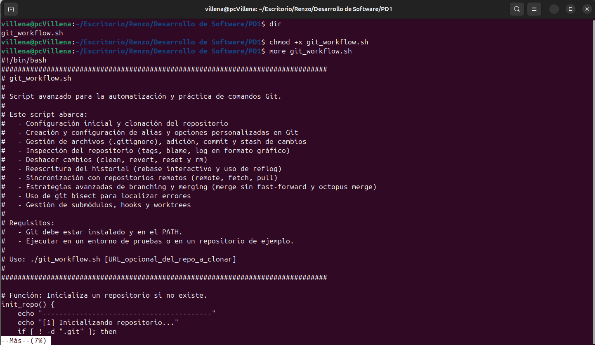
**Ejercicio 1: Configuración inicial y clonación de repositorios**  
- Ejecuta el script y observa cómo se inicializa el repositorio con `git init`.
- Si se ha pasado una URL de clonación, verifica la creación del directorio `repo_clonado`.

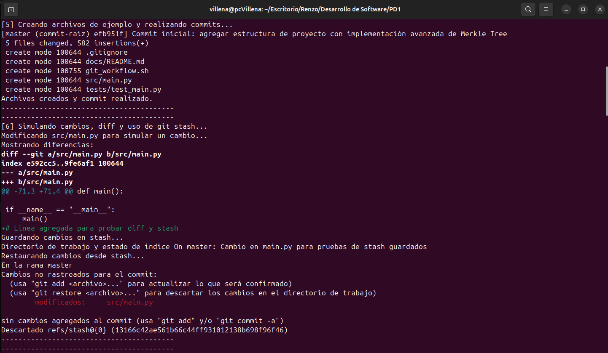
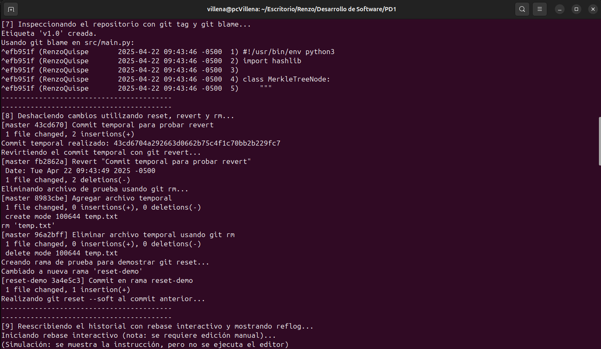
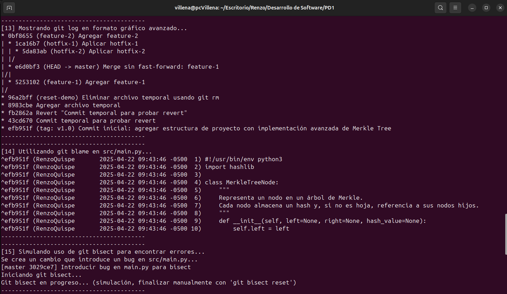
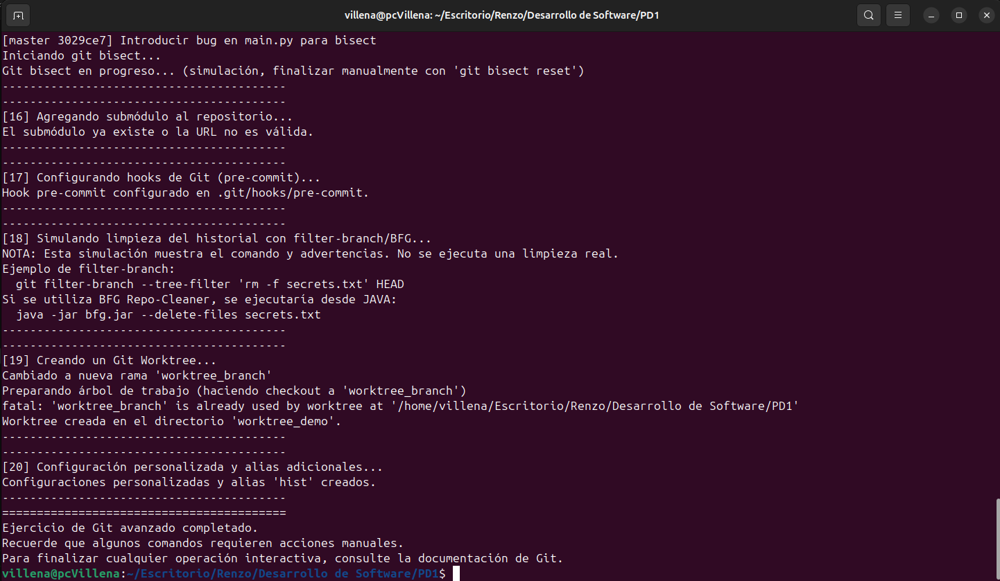    

**Paso 2. Generación de la estructura del proyecto y primer Commit**  
- El script crea automáticamente los directorios `src`, `tests` y `docs`, además de generar un archivo `.gitignore`.
- En el archivo `src/main.py` se encuentra la implementación avanzada del árbol de Merkle; repasa el código para identificar la clase `MerkleTreeNode` y las funciones `compute_hash`, `build_merkle_tree` y `print_tree`.  
- Realiza el primer commit revisando el historial con `git log --oneline`.
  
  
**Ejercicio 2: Estructuración y commit inicial**  
- Revisa el contenido del archivo `docs/README.md` y confirma que la documentación básica está presente.
- Asegúrate de que la estructura del proyecto se haya agregado correctamente al repositorio.
  
  
**Paso 3. Manejo de cambios y uso de stash**  
- El script simula la modificación de `src/main.py` agregando una línea adicional.  
- Utiliza el comando `git diff` que se muestra en pantalla para examinar las diferencias.
- La actividad te invita a ejecutar el stash y luego a restaurar los cambios para comprender el flujo:  
  ```bash
  git stash push -m "Cambio en main.py para pruebas de stash"
  git stash pop
  ```
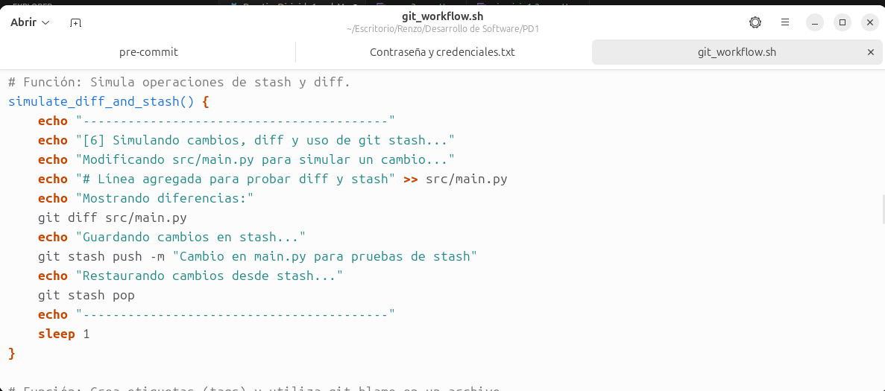   
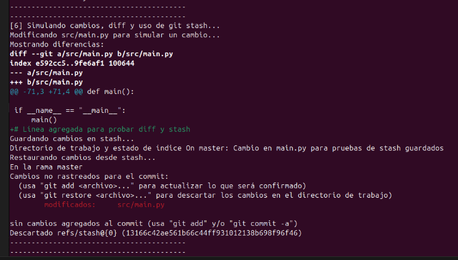 
**Ejercicio 3: Comparación de versiones y uso de stash**  
- Modifica el archivo manualmente (por ejemplo, agrega un comentario) y ejecuta nuevamente `git diff` para notar cómo se detectan los cambios.
- Experimenta con `git stash` en el entorno de práctica.
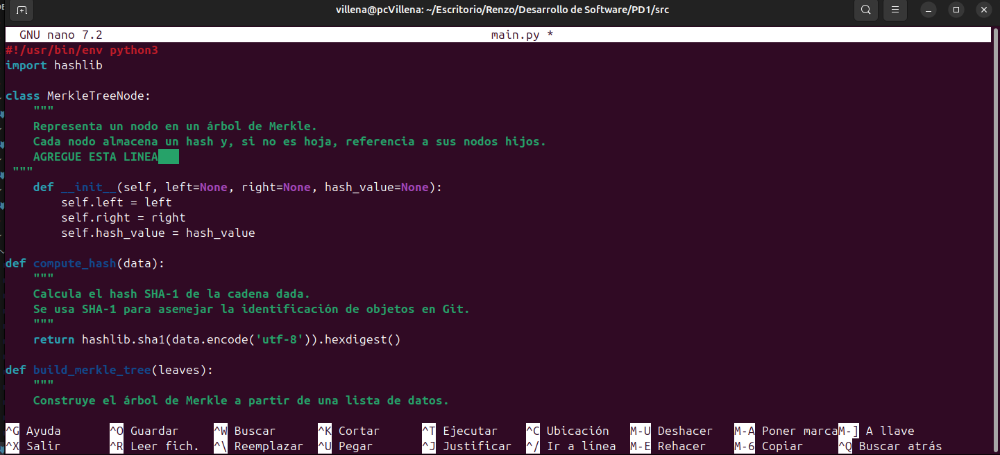 
 
 
**Paso 4. Inspección del historial y análisis de cambios**  
- Ejecuta las funciones que crean etiquetas (`git tag`) y utiliza `git blame` para observar quién ha modificado las líneas en `src/main.py`.
- Revisa el historial gráfico con `git log --graph --decorate --oneline` para entender la estructura de ramas y merges.
 
 
**Ejercicio 4: Inspección y análisis del historial**  
- Analiza la salida de `git blame` para identificar partes clave del código del árbol de Merkle.
- Toma nota de cómo la estructura del historial puede ayudar a rastrear cambios significativos.
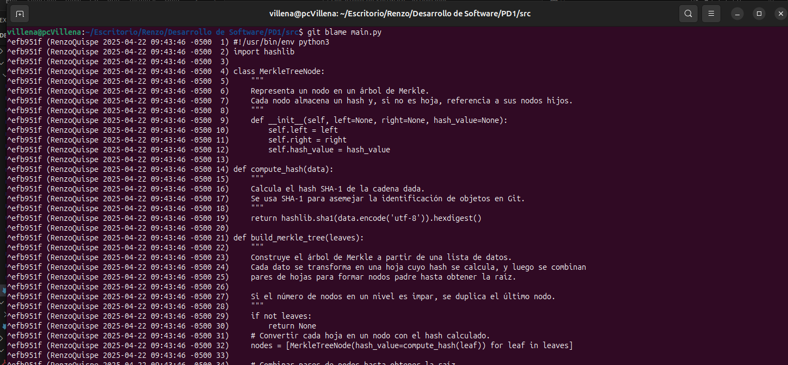 

**Paso 5. Deshacer cambios y experimentar con reset**  
- La actividad propone deshacer un commit erróneo utilizando `git revert`.
- Se crea y elimina un archivo temporal con `git rm` para comprender cómo se gestionan los cambios en el repositorio.
- En una rama de prueba se ejecuta `git reset` en sus diferentes variantes (soft, mixed y hard).
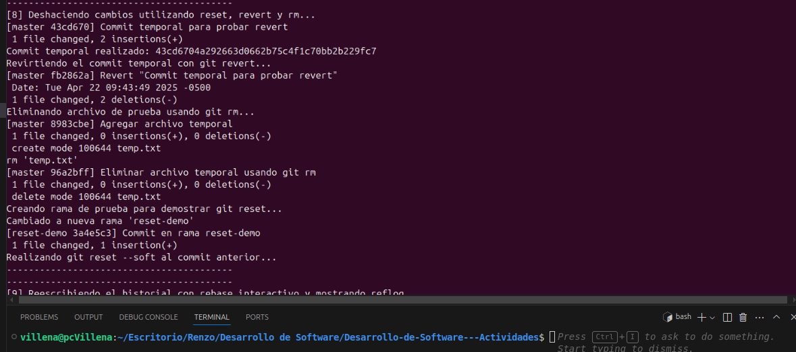

**Ejercicio 5: Deshacer cambios y reset**  
- Realiza un commit manualmente, luego usa `git revert` para deshacerlo.
 
- Crea una rama temporal, haz cambios y experimenta con los distintos modos de `git reset` para observar los efectos en el área de staging y en el directorio de trabajo.
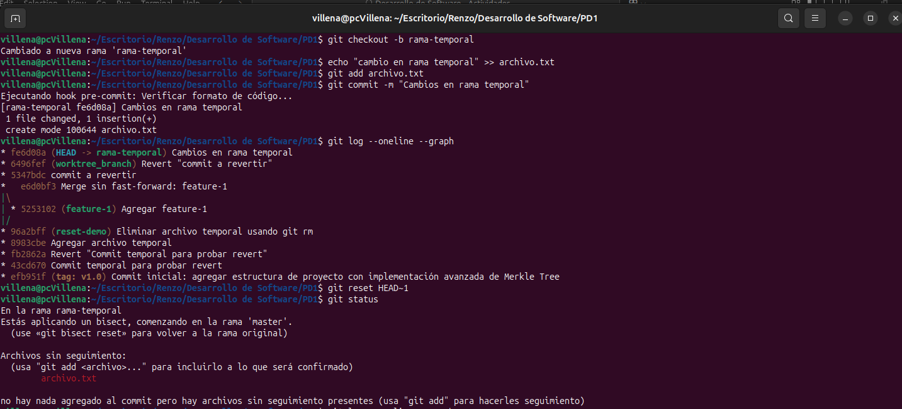 
**Paso 6. Reescritura del historial con rebase interactivo y uso de reflog**  
- El script muestra instrucciones para iniciar un `git rebase -i` (rebase interactivo) y visualiza el `git reflog` para que veas el historial de movimientos de HEAD.
- Se recomienda ejecutar la instrucción de rebase manualmente en un entorno de prueba.


**Ejercicio 6: Rebase interactivo y reflog**  
- Prepara al menos tres commits y ejecuta el comando `git rebase -i HEAD~3`.
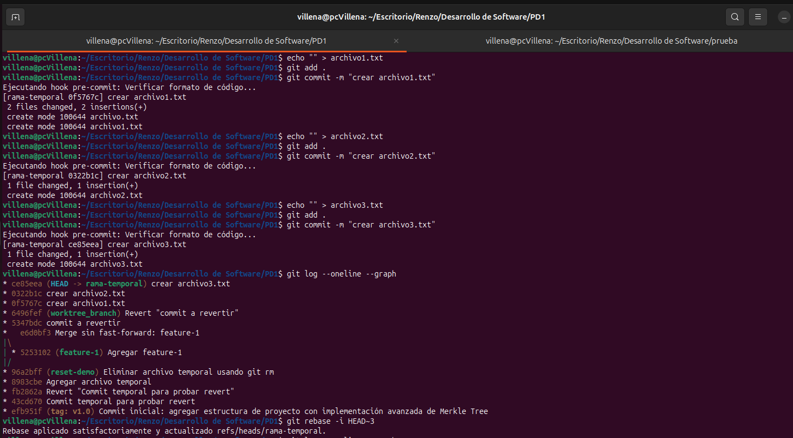 
- Consulta el `git reflog` para entender cómo se registran los cambios de punteros en el repositorio.
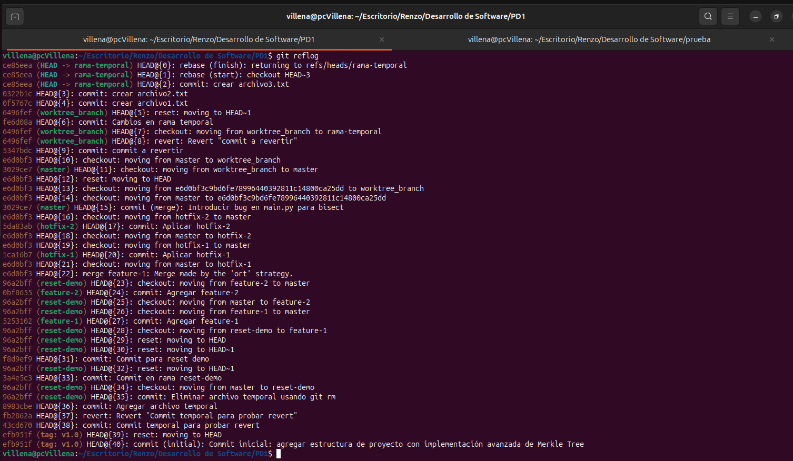 

**Paso 7. Sincronización de repositorios remotos**  
- Aunque se usa una URL de ejemplo, en esta actividad se simula la sincronización remota mediante `git remote add`, `git fetch` y `git pull`.
- Si tienes acceso a un repositorio remoto de prueba, utiliza estos comandos para actualizar tu rama local.
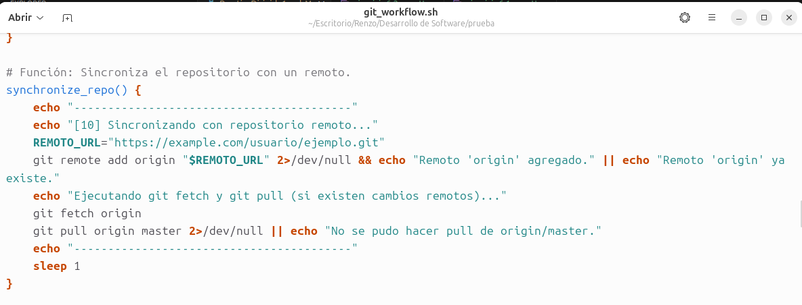

**Ejercicio 7: Sincronización de repositorios**  
- Agrega manualmente un remoto y verifica la comunicación entre el repositorio local y el remoto.
- Simula la resolución de conflictos si modificas manualmente un mismo archivo en dos ramas diferentes.
 

**Paso 8. Estrategias avanzadas de branching y merging**  
- El script crea ramas para nuevas funcionalidades y hotfixes.  
- Se ejecuta un merge sin fast-forward y luego un octopus merge para unir varias ramas simultáneamente.
- Revisa el historial con `git log --graph` para observar la estructura de merges.
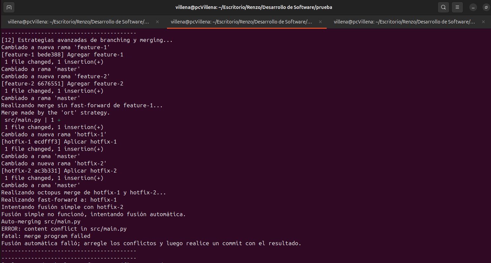

**Ejercicio 8: Branching y merging avanzado**  
- Crea tus propias ramas (p. ej., `feature-A`, `hotfix-B`) y prueba diferentes estrategias de merge.
- Documenta los resultados y discute las ventajas de cada técnica.
 
**Paso 9. Uso de git bisect para identificar errores**  
- Se introduce intencionadamente un error en `src/main.py` para que practiques con `git bisect`.
- Sigue el proceso de bisect asignando un commit “bueno” y uno “malo” para identificar el cambio que introdujo el error.

**Ejercicio 9: Localización de errores con bisect**  
- Ejecuta los comandos de bisect (inicio, marcar commit bueno y commit malo) y determina en qué commit se introdujo el bug.
- Finaliza la sesión de bisect con `git bisect reset`.
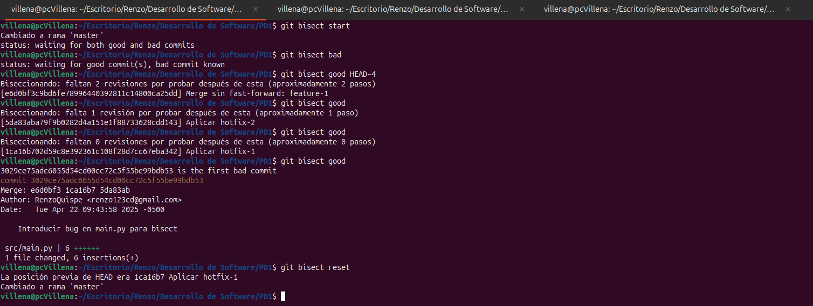 

**Paso 10. Gestión de submódulos y configuración de hooks**  
- Agrega un submódulo utilizando el comando `git submodule add` y verifica su funcionamiento.
- Configura un hook pre-commit que, al realizar un commit, muestre un mensaje o ejecute una comprobación de formato de código.


**Ejercicio 10: Submódulos y hooks**  
- Implementa la configuración del submódulo y realiza pruebas para asegurarte de que se integre correctamente.
- Valida la ejecución del hook haciendo un commit y observando el mensaje de verificación.


**Paso 11. Limpieza del historial y creación de worktrees**  
- El script incluye una sección que simula la limpieza del historial (con `git filter-branch` o BFG Repo-Cleaner) y la creación de un Git Worktree.
- Utiliza la funcionalidad de worktree para trabajar en una rama de forma aislada sin afectar el repositorio principal.
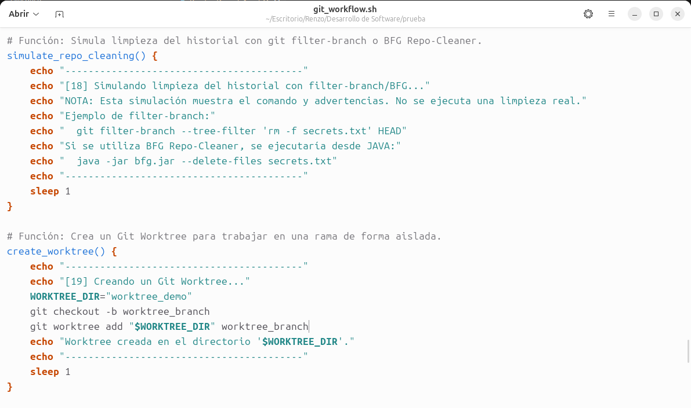
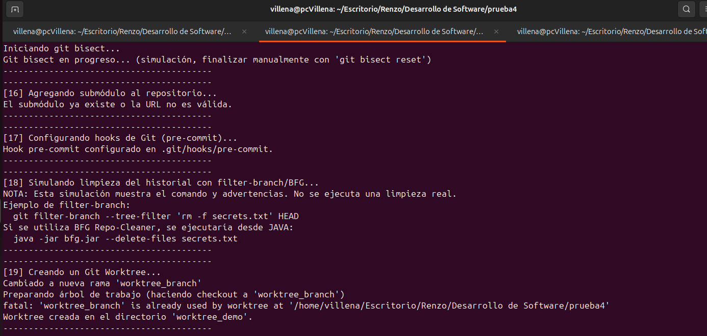
**Ejercicio 11: Historial y worktrees**  
- Simula la limpieza del historial siguiendo las indicaciones.
- Crea un worktree y realiza pruebas en ese entorno, verificando cómo se sincroniza con la rama principal.

**Paso 12. Implementación y prueba del árbol de Merkle**  
- Analiza el contenido del archivo `src/main.py`, revisando cómo se implementa la estructura de un árbol de Merkle.
- Ejecuta el script Python para ver el árbol construido a partir de datos de ejemplo y examina el hash de la raíz y la estructura completa.
- Ejecuta los tests unitarios ubicados en `tests/test_main.py` para validar el correcto funcionamiento del árbol.

**Ejercicio 12: Árbol de Merkle**  
- Ejecuta el siguiente comando en la terminal:  
  ```bash
  python3 src/main.py
  ```  
  y observa la salida que muestra el hash de la raíz y la estructura jerárquica del árbol.  
- Ejecuta las pruebas unitarias con:  
  ```bash
  python3 -m unittest discover tests
  ```  

**Ejercicio 13: Verificación extendida de pruebas de Merkle**  
   - Añade en `merkletree.py` una nueva función que reciba un proof generado por request_proof y el elemento original, y que verifique de forma recursiva si la prueba reconstruye correctamente el hash de la raíz.  
   - Modifica `test_merkletree.py` para incluir casos de prueba donde se compare el resultado de la verificación ante cambios menores en el proof, comprobando que se detectan inconsistencias.

**Ejercicio 14: Soporte para algoritmos de hash variables**  
   - Implementa en `merkletree.py` la posibilidad de elegir entre distintos algoritmos de hash (por ejemplo, SHA-1 y SHA-256) a través del parámetro digest_delegate.  
   - Crea nuevos casos en `test_merkletree.py` que construyan árboles usando ambos algoritmos, comparando resultados y analizando diferencias en la longitud y formato de los hash resultantes.

**Ejercicio 15: Integración continua en el flujo git**  
   - Amplía el script `git_workflow.sh` para que, tras cada commit o merge, se ejecute automáticamente la suite de pruebas Python.  
   - Configura un hook (por ejemplo, un pre-push) que invoque "python3 -m unittest discover tests" y notifique el resultado en la terminal, simulando un entorno de integración continua que garantice la integridad del árbol de Merkle tras cada cambio.

**Ejercicio 16: Manejo de grandes volúmenes de datos**  
   - Genera un script en Python que construya un árbol de Merkle con una colección muy numerosa (por ejemplo, 10.000 elementos generados aleatoriamente).  
   - Mide el rendimiento y analiza la sensibilidad del hash raíz ante la modificación de un único elemento.  
   - Incorpora pruebas de rendimiento que se integren al flujo de `git_workflow.sh`, mostrando estadísticas de tiempo de construcción y verificación.

**Ejercicio 17: Visualización avanzada del árbol**  
   - Extiende la función dump de `merkletree.py` para que, además de imprimir por consola, exporte la estructura del árbol a un archivo en formato JSON o compatible con Graphviz.  
   - Crea un pequeño script que lea este archivo y genere una visualización gráfica del árbol.  
   - Considera incorporar esta salida visual en el log del flujo de `git_workflow.sh` para documentar la integridad de datos.

**Ejercicio 18: Comparación de árboles entre ramas**  
   - En `git_workflow.sh`, simula la creación de dos ramas con conjuntos de "commits" distintos (por ejemplo, utilizando datos diferentes) y construye dos árboles de Merkle correspondientes.  
   - Desarrolla una función en merkletree.py que compare recursivamente ambos árboles para identificar el primer punto de divergencia, mostrando las diferencias encontradas (por ejemplo, las hojas modificadas o la variación en el hash del nodo padre).  
   - Integra esta funcionalidad en el script y añade mensajes descriptivos que expliquen cómo una modificación en un archivo impacta la integridad general en distintas ramas.

**Ejercicio 19: Validación ante modificaciones adversariales**  
   - Crea nuevos casos de prueba en `test_merkletree.py` donde se simulen modificaciones intencionales (por ejemplo, alterar un solo byte de una hoja) para comprobar cómo se invalida el proof de Merkle.  
   - Implementa una función que, dado un proof y el elemento original, indique en qué punto exacto se rompe la cadena de verificación.  
   - Utiliza este mecanismo para demostrar, en el contexto del flujo Git, cómo cualquier alteración en los archivos "committed" es detectable mediante la comparación de hash.

**Ejercicio 20: Actualización dinámica y monitorización de cambios**  
   - Desarrolla un script adicional (puede integrarse en `git_workflow.sh` o como un script independiente) que utilice herramientas de monitorización de archivos (por ejemplo, inotify en Linux) para detectar cambios en un directorio.  
   - Cada vez que se produzca un cambio, el script deberá reconstruir el árbol de Merkle con los datos actualizados y mostrar el nuevo hash raíz, comparándolo con el anterior para evidenciar la propagación de modificaciones.  
   - Esta herramienta servirá para simular la verificación en tiempo real de la integridad de un repositorio y puede integrarse como una capa extra de validación en el ciclo de desarrollo.

**Ejercicio 21: Pre-commit hook para validar la integridad del árbol de Merkle**  
   - Diseña un hook pre-commit (por ejemplo, en `.git/hooks/pre-commit`) que ejecute un script en Python para reconstruir el árbol de Merkle a partir de un conjunto de archivos críticos del repositorio.  
   - El hook debe comparar el hash raíz obtenido con un valor almacenado previamente en el repositorio (por ejemplo, en un archivo de configuración).  
   - En caso de discrepancia, cancelar el commit y emitir un mensaje indicando que se detectó una posible manipulación en la integridad de los datos.

**Ejercicio 22: Commit-msg Hook para validar mensajes de commit y verificación de pruebas**  
   - Crea un hook `commit-msg` que, además de validar el formato del mensaje (por ejemplo, se exija incluir un identificador o una referencia al árbol generado), invoque un script que ejecute la suite de pruebas de `merkletree.py`.  
   - El script deberá rechazar el commit si alguna de las pruebas falla, garantizando que las operaciones que afectan la integridad del árbol se encuentren validadas antes de integrarse en la historia del proyecto.

**Ejercicio 23: Pre-push Hook para ejecución de pruebas unitarias**  
   - Implementa un hook pre-push que se encargue de ejecutar "python3 -m unittest discover tests" antes de enviar cambios al repositorio remoto.  
   - El hook deberá capturar la salida de las pruebas y, en caso de error, detener el push y enviar un reporte resumido al desarrollador, permitiendo una integración continua de las verificaciones de los árboles de Merkle y otros componentes.

**Ejercicio 24: Post-commit hook para actualización automática del hash de integridad**  
   - Desarrolla un hook post-commit que, tras cada commit exitoso, construya de forma automática un árbol de Merkle tomando como fuente la lista de archivos o incluso los mensajes de commit recientes.  
   - El script deberá almacenar el nuevo hash raíz en un archivo interno del repositorio (por ejemplo, en docs/integrity.txt) y notificar al usuario la actualización, sirviendo como log de integridad de la historia de cambios.

**Ejercicio 25: Hook personalizado para comparación entre ramas**  
   - Diseña un hook (puede ser un pre-merge o post-merge) que, al fusionar ramas, invoque un script en Python que construya dos árboles de Merkle: uno a partir de la rama principal y otro a partir de la rama fusionada.  
   - El script debe comparar ambas estructuras y resaltar las diferencias, mostrando en la salida del hook cuáles han sido los puntos de divergencia en la integridad de datos.  
   - Esta comparación puede ser particularmente útil para detectar cambios inesperados o inconsistencias durante merges complejos (por ejemplo, **octopus merge**).

**Ejercicio 26: Integración de monitoreo y hook dinámico de archivos**  
   - Implementa, adicionalmente al script de `git_workflow.sh`, una herramienta en Python que utilice un mecanismo de *file watcher* (por ejemplo, *inotify** en Linux) para vigilar cambios en directorios críticos.  
   - Configura un hook (puede ser un pre-push o un hook independiente que se ejecute en background) que cada vez que se detecte un cambio significativo, reconstruya el árbol de Merkle y compare el hash raíz actual contra el esperado.  
   - El resultado de la comparación se integrará en un log, y en caso de error, se notificará vía correo o mensaje al equipo de desarrollo.

**Ejercicio 27: Validación de proofs de integridad en hooks**  
   - Agrega un ejercicio en el que se extienda la funcionalidad de la función `request_proof` en `merkletree.py` para incluir una verificación completa del proof recibido.  
   - Crea un hook (por ejemplo, `commit-msg` o `pre-push`) que solicite la prueba para un conjunto de elementos críticos y, utilizando la función extendida, verifique que cada uno de ellos se encuentre respaldado por un proof válido.  
   - El hook rechazará la operación si algún proof falla en la validación, incrementando la seguridad en la integración de cambios.