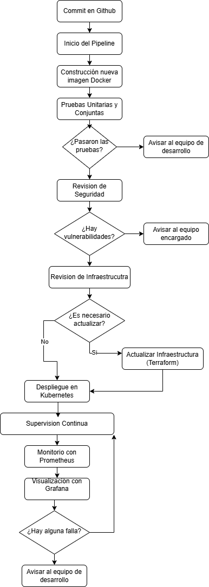

##  **Actividad 2: Del código a la producción: Infraestructura, contenedores, despliegue y observabilidad**

### Tareas Teóricas

#### - Investigar una herramienta de IaC (p. ej. Terraform) y describir cómo organiza sus módulos.
Terraform: Es una herramienta que sirve para automatizar, configurar y administrar nuestra infraestructura de manera sencilla. Organiza dicha configuración mediante módulos. Es de codigo abierto y es desarrollado por HashiCorp
Los modulos sirven para empaquetar y reutilizar configuraciones de recursos, son separados por funcionalidad.
#### - Proponer la estructura de archivos y directorios para un proyecto hipotético que incluya tres módulos: network, database y application. Justificar la jerarquía elegida.
infraestructura
    main.tf        # Conecta los modulos
    modulos
        red            
            main.tf
            variables.tf   #variables que necesita el modulo
            outputs.tf     #output "local"
        bd
            main.tf
            variables.tf   #variables que necesita el modulo
            outputs.tf
        aplicacion
            main.tf
            variables.tf   #variables que necesita el modulo
            outputs.tf
Esta forma de organizacion es clara y ordenada, ademas cada modulo es reutiliable. 
#### - Describir un flujo simple de despliegue donde un desarrollador hace un cambio en el código, se construye una nueva imagen Docker y se actualiza un Deployment de Kubernetes.
- Se hace un cambio en el codigo
- Se actualiza el repositorio remoto
- Construccion de una nueva imagen docker 
- Se guarda la nueva imagen docker (Docker Hub)
- Se actualiza el deployment de Kubernetes
- kubernetes reemplaza los contenedores antiguos
#### - Explicar las ventajas de usar Kubernetes para escalar una aplicación en un evento de alto tráfico.
- Reparte el trafico de manera eficiente.
- Permite agregar mas recursos cuando sea necesario 
- Si un contenedor falla, kubernetes puede reemplazarlo automaticamente 
- Permite escalar la aplicacion automaticamente cuando hay mas trafico.
#### - Investigar y describir cómo Prometheus y Grafana se integran con Kubernetes para monitorear los contenedores y el cluster.
Prometheus recoge las caracteristicas y metricas de los contenedores de Kubernetes(Uso de CPU y memoria, Detalles sobre las peticiones, etc).
Grafana sirve para mostrar visualmente mediante graficos las metricas recogidas por Prometheus.
Ambos se pueden desplegar como contenedores dentro del cluster y de esta manera trabajar juntos.
Asi trabajando juntos son una gran herramienta de monitorio en tiempo real.
#### - Proponer un set de métricas y alertas mínimas para una aplicación web (por ejemplo, latencia de peticiones, uso de CPU/memoria, tasa de errores).
Métricas
- Uso de memoria 
- Cuanto tarda en responder la aplicacion (latencia de peticiones)
- Cuanto procesamiento usa la aplicacion web
- Porcentaje de respuesta con errores
Alerta Mínimas
- Uso de memoria: Mas de 80%
- Tiempo de respuesta mayor a un segundo
- Mas de 10% de errores en las respuestas
#### - Explicar la diferencia entre entrega continua (continuous delivery) y despliegue continuo (continuous deployment).
En entrega continua, el software se prepara automaticamente para produccion, pero el despliegue no es automatico, hay mas control de las nuevas versiones del software. En cambio en el despliegue continuo las pruebas y el despliegue es automatico.
##### - Describir la relevancia de implementar pruebas automáticas (unitarias, de integración, de seguridad) dentro del pipeline.
- Con las pruebas unitarias hacemos una verificacion ordenada de errores de tal manera que es mas facil entender los errores
- Con las pruebas de integracion verficacmos que los componentes trabajan bien con otros componentes
- Deteccion de debilidades del sistema (Seguridad)
- Evitar errores de la aplicacion en producción.
- Deteccion rapida de errores.

### Evaluación de la teoría
#### - Cada estudiante deberá redactar un informe sobre la importancia de IaC, contenedores, Kubernetes, observabilidad y CI/CD para la entrega ágil y confiable de software.

Para entregar software de forma rápida y segura se utilizan herramientas modernas que nos ayudan automatizar tareas, escalar fácilmente(escalabilidad) y monitorear en tiempo real(observabilidad). Se detallara la importancia de las herramientas estudiadas:

- IaC: Permite definir y configurar servidores, redes y otros recursos con archivos de texto. Terraform es un ejemplo de herramienta IaC que organiza la infraestructura en módulos reutilizables. Esto mejora el orden, la automatización y facilita la colaboración entre equipos.
- Contenedores: Los contenedores empaquetan todo lo que necesita una aplicación para funcionar. Con ellos las aplicaciones se ejecutan en cualquier entorno, esto evita errores y hace mas facil el despliegue.
- Kubernetes: Es un orquestador de contenedores. Permite distribuir el tráfico, escalar automáticamente cuando hay más usuarios y recuperar contenedores si fallan. Todo esto sin intervención manual, haciendo que la aplicación esté siempre disponible.
- Observabilidad: Prometheus recolecta metricas del sistema, como uso de CPU, memoria y errores y con Grafana se muestra dicha informacion en gráficos en tiempo real. Juntos permiten monitorear el estado de la aplicación y activar alertas cuando hay errores.
- CI/CD:
Automatiza desde que el desarrollador sube un cambio hasta que se despliega en producción. Incluye pruebas automáticas (unitarias, integración y seguridad), creación de imágenes Docker y despliegue en Kubernetes. Esto reduce errores, acelera las entregas y mejora la calidad del software.

#### - Identificar riesgos y desafíos (p.e. sobrecarga cognitiva, necesidad de capacitación, configuración de seguridad).  
- Es importante una adecuada capacitacion para dominar las herramientas.
- Puede generar una "sobrecarga cognitiva" al principio ya que en el proceso se usan muchas tecnologias.  
- Es importante una adecuada configuracion de seguridad en las constantes implementaciones.

### Trabajo colaborativo
#### - En grupos, diseñar un flujo teórico que combine IaC (para crear recursos en la nube), despliegue de contenedores en Kubernetes y monitoreo con Prometheus/Grafana.
- Uno de los desarrolladores hace un commit en el repositorio(Github)
- Con Github Actions inicia el pipeline
  - Se construye la imagen docker
  - Pruebas unitarias y conjuntas en el contenedor
  - Busqueda de fallas de seguridad
- Si necesitamos cambios en la infraestructura usamos un script de Terraform
- Nuevo despligue en Kubernetes usando la nueva imagen
- Prometheus recoge metricas de los contenedores
- Con Grafana mostramos los datos a tiempo real, se activan la alertas si hay errores
- Un equipo se encarga del monitoreo constante
#### - Presentar el flujo en un diagrama que incluya cada paso desde el commit hasta la visualización de métricas en tiempo real.
