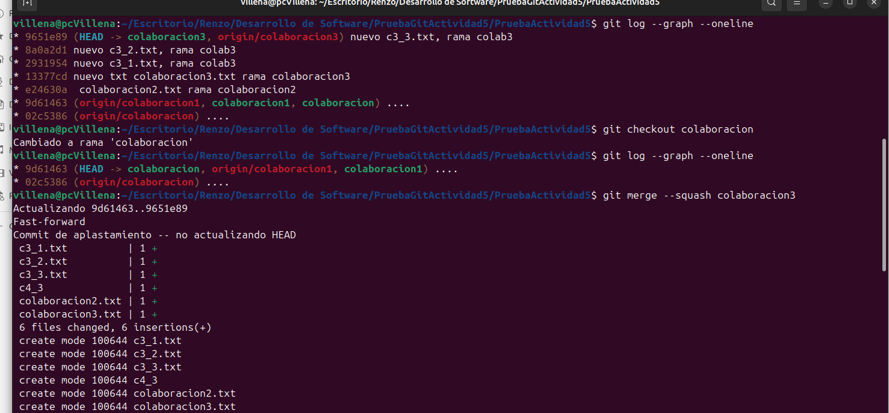

## **Actividad 5: Explorando diferentes formas de fusionar en Git**

### **Objetivo de aprendizaje:**  

En esta actividad, exploraremos el proceso de fusionar dos ramas en Git utilizando tres métodos diferentes: fast-forward, no-fast-forward y squash. A través de los ejemplos, comprenderás cómo funcionan y cuándo es recomendable utilizar cada tipo de fusión.

### Fusión Fast-forward (git merge --ff)
- Pasos Practicos - Ejemplo

### Fusión No-fast-forward (git merge --no-ff)
- Pasos Practicos - Ejemplo

### Fusión squash (git merge --squash)
- Pasos Practicos - Ejemplo

### Ejercicios
#### 1. Clona un repositorio Git con múltiples ramas.

#### 2. Simula un flujo de trabajo de equipo.

#### 3. Crea múltiples commits en una rama.

### Resolver conflictos en una fusión non-fast-forward

### Ejercicio 1: Comparar los historiales con git log después de diferentes fusiones

### Ejercicio 2: Usando fusiones automáticas y revertir fusiones

### Ejercicio 3: Fusión remota en un repositorio colaborativo

### Ejercicio final: flujo de trabajo completo

